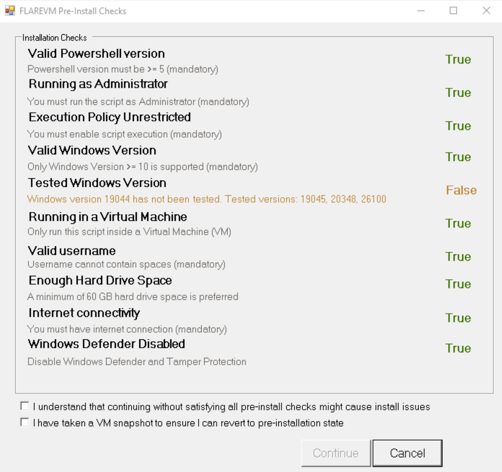
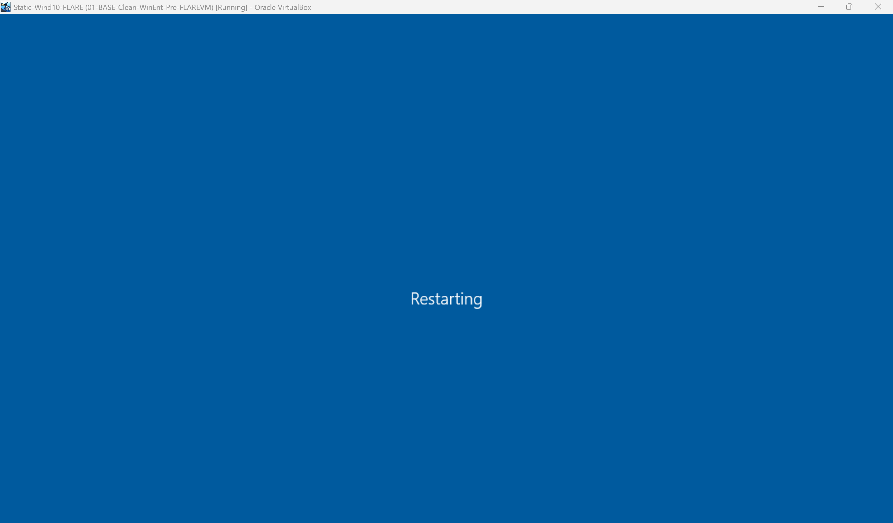
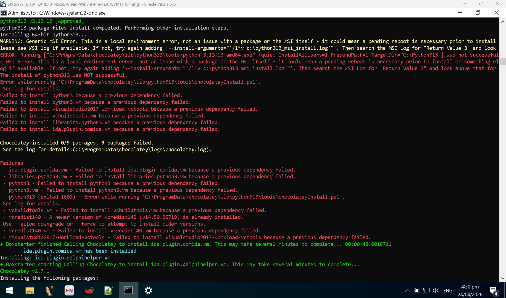
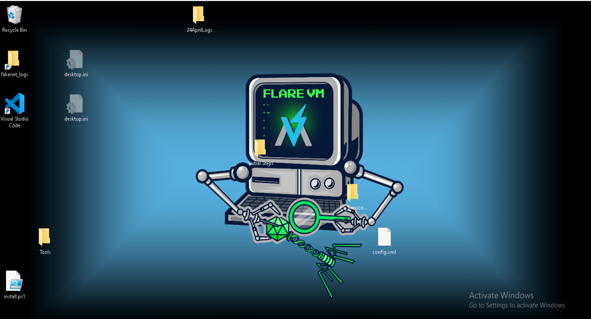
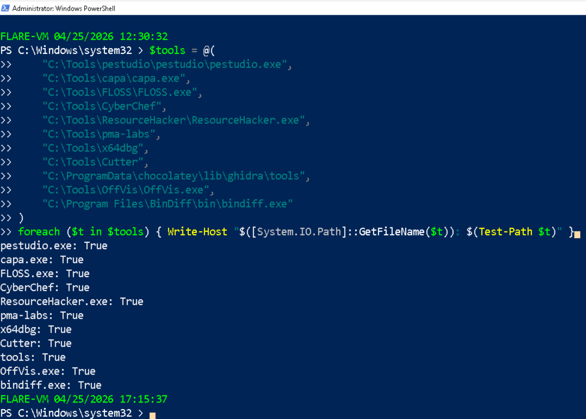
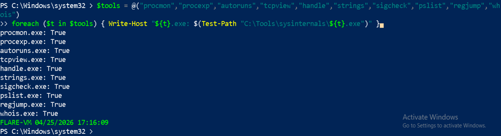
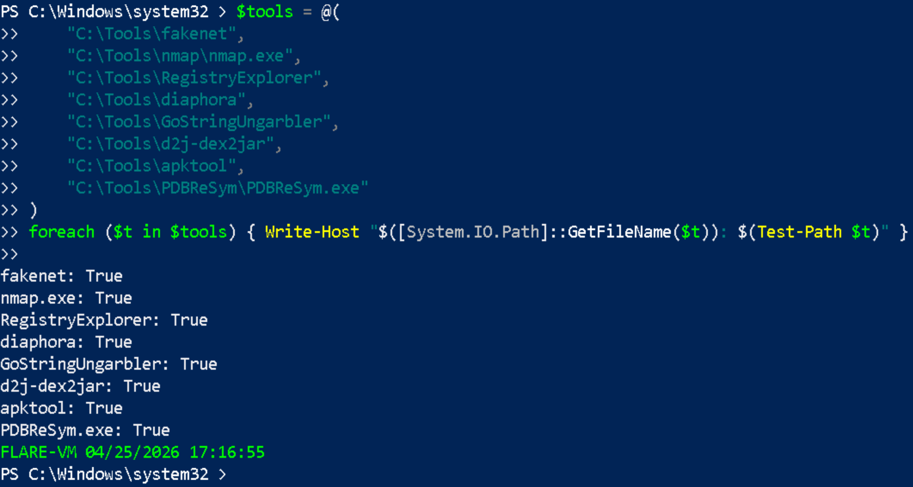
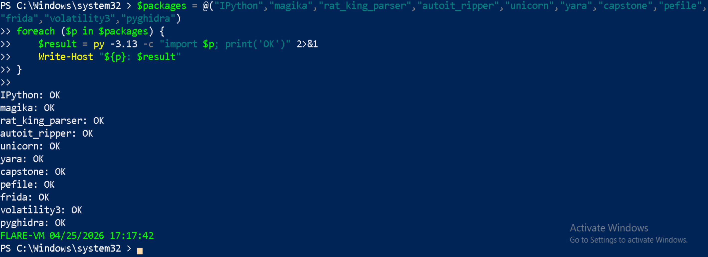
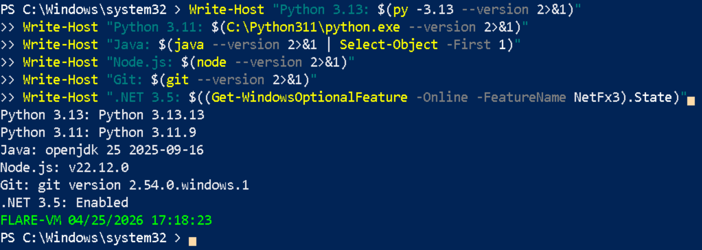
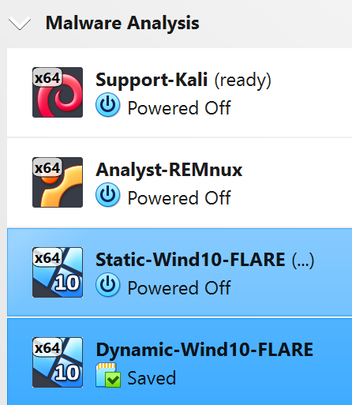

# Lab 01 — FLARE-VM Installation Troubleshooting Log
**Date:** 24 April 2026  
**Author:** Emilio Mardones (Ofendor)  
**Status:** ✅ Resolved  
**Related:** [Lab 01 Setup Notes](lab-01-setup-notes.md)

## Pre-Install Setup and Invocation

This section documents everything that happened during the FLARE-VM installation on `Static-Wind10-FLARE` virtual machine. 
Several decisions I made directly caused the failures documented below. I included everything that happened and how I troubleshoot the issues then fixed. Have in mind that issues listed here might differ from the ones you might encounter.

Before running FLARE-VM, several tools had been manually pre-installed on the VM including Python 3.13.13, Wireshark, Nmap, and 7-Zip. This was done before understanding that FLARE-VM manages it alone through Chocolatey. Pre installing apps create version conflicts that are difficult and time consuming to resolve.

Additionally, I personally believe that documenting what went wrong is as important as documenting what worked. A clean install teaches you nothing if you are a beginner. Troubleshooting a broken one teaches you how Windows package management, Python environments, and dependency chains actually behave, which is exactly the kind of knowledge that matters in a SOC or malware analysis role.
## 1. Download FLARE-VM

FLARE-VM is not a traditional installer. It is a PowerShell-based package manager configuration that uses Chocolatey to install and configure all tools automatically. The repository is cloned directly from Mandiant's GitHub.

```powershell
# Set execution policy to allow PowerShell scripts to run
Set-ExecutionPolicy Unrestricted -Force

# Move to the Desktop where the install will run from
cd $env:USERPROFILE\Desktop

# Download the installer into your VM Desktop
(New-Object net.webclient).DownloadFile('https://raw.githubusercontent.com/mandiant/flare-vm/main/install.ps1',"$([Environment]::GetFolderPath("Desktop"))\install.ps1")
# Note: downloading process starts. A file 'install.ps1' has been downloaded into your desktop. Confirm, move to the next step

# This command should retunr True, meaning the file was downloaded
Test-Path "$env:USERPROFILE\Desktop\install.ps1"
```


**Reason:** PowerShell blocks unsigned scripts by default. The `Unrestricted` is necessary specifically for this install because it will allow the FLARE-VM script to run without a digital signature. This should only be done inside the VM, never on a host machine. 


---
## 2. Disable Windows Defender and Snapshot

Windows Defender must be completely disabled before running FLARE-VM. If Defender is active during installation it will quarantine several tools that are legitimate malware analysis utilities (i.e., FLOSS, CAPA), and trigger Defender signatures because they analyse malicious code patterns. If Defender quarantines these files the entire package chain fails.

```powershell
# Disable Windows Defender real-time protection
Set-MpPreference -DisableRealtimeMonitoring $true

# Disable Defender completely via registry. When asking for a name just type 1
New-ItemProperty -Path "HKLM:\SOFTWARE\Policies\Microsoft\Windows Defender" `
  -Name "DisableAntiSpyware" -Value 1 -PropertyType DWORD -Force

# Verify Defender is disabled
Get-MpPreference | Select-Object DisableRealtimeMonitoring
```

<div align="center">
  
  <p><em>PowerShell verification output confirming monitoring features disabled</em></p>
</div>

⚠️ Now make a base snapshot in case the install fails so you can rollback to this point.

---
## 3. Invoking the FLARE-VM Installer

```powershell
# Download the installer into your VM
Invoke-WebRequest -Uri "https://raw.githubusercontent.com/mandiant/flare-vm/main/install.ps1" -OutFile "$env:USERPROFILE\Desktop\install.ps1"

# Unblock the install script
Unblock-File -Path "$env:USERPROFILE\Desktop\install.ps1"

# Launches the FLARE-VM installer. This script should be use cautiosly because allows unsigned things to run or download
Set-ExecutionPolicy Unrestricted -Scope CurrentUser -Force
```

**Reason: `Unblock-File` first:** Windows marks files downloaded from the internet with an NTFS Zone Identifier flag. PowerShell refuses to run flagged scripts even with `Unrestricted` execution policy. `Unblock-File` removes this flag so the script can execute.

<div align="center">
  
  </div>

```powershell
# Move back to the Desktop directory
cd "$env:USERPROFILE\Desktop"

# Start the installation. It will prompt you for username and password of your current VM, after this it starts installing
.\install.ps1
```
  
---
## 4. FLARE-VM Pre-Installer GUI Checks

After invoking `.\install.ps1` FLARE-VM runs an automated some checks before presenting the tool selection GUI. To satisfy the required set up, the checks are confirmed either True or False:

<div align="center">
  
  </div>

If any check fails FLARE-VM will warn you but still proceed because it does not abort on warnings. Tick the two boxes below and continue.

**Note:** *Tested Windows Version* shows FALSE. Do not worry if you see this. I've installed Windows 10 Enterprise build 19044 LTSC 2021. FLARE-VM's versions are one number above, but this overall satisfies 22H2 window's standard.

<div align="center">
  
  </div>

Second prompt will ask you to specify where to install everything. My suggestion is to leave it as default and continue. 

---

## 5. Tool Selection GUI

<div align="center">
  
  </div>

After the pre-install checks pass FLARE-VM presents a GUI where you select which tool categories and individual tools to install. The selection made during this install included a set of tools that skipped legacy or outdated ones. As per 2026 this is the selection I suggest. Feel free to do your own choice based on your needs:

#### *Debuggers*
Used to run malware step-by-step and inspect behaviour in real time.

| Tool                          | Action   |
| ----------------------------- | -------- |
| capesolo.vm                   | ✅ ticked |
| ollydbg.plugin.ollydumpex.vm  | ❌ untick |
| ollydbg.plugin.scyllahide.vm  | ❌ untick |
| ollydbg.vm                    | ❌ untick |
| ollydbg2.plugin.ollydumpex.vm | ❌ untick |
| ollydbg2.plugin.scyllahide.vm | ❌ untick |
| ollydbg2.vm                   | ❌ untick |
| ttd.vm                        | ✅ ticked |
| windbg.vm                     | ✅ ticked |
| x64dbg.plugin.dbgchild.vm     | ✅ ticked |
| x64dbg.plugin.scyllahide.vm   | ✅ ticked |
| x64dbg.plugin.x64dbgpy.vm     | ✅ ticked |
| x64dbg.vm                     | ✅ ticked |

#### *Delphi*

idr.vm keep ✅ ticked

#### *Disassemblers*
Used to convert compiled binaries into readable assembly or pseudo-code.

| Tool           | Action   |
| -------------- | -------- |
| binaryninja.vm | ✅ ticked |
| cutter.vm      | ✅ ticked |
| ghidra.vm      | ✅ ticked |
| idafree.vm     | ✅ ticked |
| idapro.vm      | ❌ untick |

#### *Documents*
Used to inspect malicious document-based payloads like PDFs, Office, etc.

| Tool                    | Action   |
| ----------------------- | -------- |
| didier-stevens-beta.vm  | ✅ ticked |
| didier-stevens-suite.vm | ✅ ticked |
| ezviewer.vm             | ✅ ticked |
| microsoft-office.vm     | ❌ untick |
| offvis.vm               | ✅ ticked |
| onenoteanalyzer.vm      | ✅ ticked |
| pdfstreamdumper.vm      | ✅ ticked |

#### *.NET*
Used to analyse, decompile, and unpack .NET malware.

| Tool                  | Action   |
| --------------------- | -------- |
| codetrack.vm          | ✅ ticked |
| de4dot-cex.vm         | ✅ ticked |
| dnlib.vm              | ✅ ticked |
| dnspyex.vm            | ✅ ticked |
| dotdumper.vm          | ✅ ticked |
| dotnet-6.vm           | ❌ untick |
| dotnet-8.vm           | ❌ untick |
| dotnet-9.vm           | ❌ untick |
| extreme_dumper.vm     | ✅ ticked |
| garbageman.vm         | ✅ ticked |
| ilspy.vm              | ✅ ticked |
| net-reactor-slayer.vm | ✅ ticked |
| psnotify.vm           | ✅ ticked |
| rundotnetdll.vm       | ✅ ticked |
| sfextract.vm          | ✅ ticked |

#### *File Information*
Used to identify file types, hashes, metadata, and embedded strings.

| Tool            | Action   |
| --------------- | -------- |
| bindiff.vm      | ✅ ticked |
| die.vm          | ✅ ticked |
| exeinfope.vm    | ✅ ticked |
| exiftool.vm     | ✅ ticked |
| file.vm         | ✅ ticked |
| floss.vm        | ✅ ticked |
| hasher.vm       | ✅ ticked |
| hashmyfiles.vm  | ✅ ticked |
| magika.vm       | ✅ ticked |
| stringsifter.vm | ❌ untick |

#### *Go*
Used to analyse go-based malware binaries.

| Tool                 | Action   |
| -------------------- | -------- |
| goresym.vm           | ✅ ticked |
| gostringungarbler.vm | ✅ ticked |

#### *Hex Editors*
Used to inspect and modify raw binary or hexadecimal data. 

| Tool         | Action   |
| ------------ | -------- |
| 010editor.vm | ✅ ticked |
| hxd.vm       | ✅ ticked |
| imhex.vm     | ❌ untick |

#### *IDA Plugins*
Extensions for IDA free tool.

| Tool                        | Action   |
| --------------------------- | -------- |
| ida.plugin.capa.vm          | ✅ ticked |
| ida.plugin.comida.vm        | ✅ ticked |
| ida.plugin.delphihelper.vm  | ✅ ticked |
| ida.plugin.dereferencing.vm | ✅ ticked |
| ida.plugin.diaphora.vm      | ✅ ticked |
| ida.plugin.flare.vm         | ✅ ticked |
| ida.plugin.flare-emu.vm     | ✅ ticked |
| ida.plugin.hashdb.vm        | ✅ ticked |
| ida.plugin.hrtng.vm         | ✅ ticked |
| ida.plugin.ifl.vm           | ✅ ticked |
| ida.plugin.lighthouse.vm    | ✅ ticked |
| ida.plugin.sigmaker.vm      | ✅ ticked |
| ida.plugin.xray.vm          | ✅ ticked |
| ida.plugin.xrefer.vm        | ✅ ticked |

#### *InnoSetup*
Used to extract and inspect Inno Setup installers.

| Tool           | Action   |
| -------------- | -------- |
| ifpstools.vm   | ✅ ticked |
| innoextract.vm | ✅ ticked |
| innounp.vm     | ✅ ticked |
| isd.vm         | ✅ ticked |

#### *Java and Android*
For Java and apk malware.

| Tool              | Action   |
| ----------------- | -------- |
| apktool.vm        | ✅ ticked |
| bytecodeviewer.vm | ✅ ticked |
| dex2jar.vm        | ✅ ticked |
| openjdk.vm        | ✅ ticked |
| recaf.vm          | ✅ ticked |

#### *Javascript*
Used to beautify and deobfuscate malicious JavaScript

| Tool                          | Action   |
| ----------------------------- | -------- |
| js-beautify.vm                | ✅ ticked |
| js-deobfuscator.vm            | ✅ ticked |
| malware-jail.vm               | ✅ ticked |
| nodejs.vm                     | ❌ untick |
| obfuscator-io-deobfuscator.vm | ✅ ticked |

#### *Memory*
Used to detect injected code and extract malware from memory.

| Tool             | Action   |
| ---------------- | -------- |
| hollowshunter.vm | ✅ ticked |
| pesieve.vm       | ✅ ticked |
| processdump.vm   | ✅ ticked |

#### *Networking*
Used to monitor, intercept, and simulate network traffic.

| Tool                 | Action   |
| -------------------- | -------- |
| fakenet-ng.vm        | ✅ ticked |
| fiddler.vm           | ✅ ticked |
| internet_detector.vm | ✅ ticked |
| networkminer.vm      | ❌ untick |
| nmap.vm              | ✅ ticked |
| npcap.vm             | ✅ ticked |
| openvpn.vm           | ❌ untick |
| powercat.vm          | ❌ untick |
| putty.vm             | ✅ ticked |
| streamdivert.vm      | ❌ untick |
| telnet.vm            | ❌ untick |
| windump.vm           | ✅ ticked |
| wireshark.vm         | ✅ ticked |

#### *Packers*
Used to unpack installers, archives, and packed malware samples.

| Tool                  | Action   |
| --------------------- | -------- |
| advanced-installer.vm | ✅ ticked |
| asar.vm               | ✅ ticked |
| autoit-ripper.vm      | ✅ ticked |
| pkg-unpacker.vm       | ✅ ticked |
| uniextract2.vm        | ✅ ticked |
| upx.vm                | ✅ ticked |

#### *PE Analysis*
Used to inspect Port Executables (PE) structure and headers

| Tool                     | Action   |
| ------------------------ | -------- |
| dependencywalker.vm      | ✅ ticked |
| dll-to-exe.vm            | ✅ ticked |
| explorersuite.vm         | ✅ ticked |
| pdbs.pdbresym.vm         | ❌ untick |
| pe_unmapper.vm           | ✅ ticked |
| peanatomist.vm           | ❌ untick |
| pebear.vm                | ✅ ticked |
| peid.vm                  | ✅ ticked |
| pestudio.vm              | ✅ ticked |
| setdllcharacteristics.vm | ❌ untick |

#### *Productivity*
Editing, scripting, compiling, and workflow efficiency tools.

| Tool                         | Action   |
| ---------------------------- | -------- |
| 7zip.vm                      | ✅ ticked |
| chrome.extensions.vm         | ❌ untick |
| cmder.vm                     | ✅ ticked |
| cygwin.vm                    | ✅ ticked |
| dokan.vm                     | ❌ untick |
| googlechrome.vm              | ❌ untick |
| ipython.vm                   | ✅ ticked |
| nasm.vm                      | ✅ ticked |
| notepadplusplus.vm           | ✅ ticked |
| notepadpp.plugin.compare.vm  | ✅ ticked |
| notepadpp.plugin.jstool.vm   | ✅ ticked |
| notepadpp.plugin.xtmtools.vm | ✅ ticked |
| tor-browser.vm               | ❌ untick |
| vcbuildtools.vm              | ✅ ticked |
| vcredist140.vm               | ❌ untick |
| visualstudio.vm              | ❌ untick |
| vscode.extension.jupyter.vm  | ✅ ticked |
| vscode.extension.python.vm   | ✅ ticked |
| vscode.vm                    | ✅ ticked |
| windows-terminal.vm          | ❌ untick |

#### *Python*
Decompile and analyse Python-based malware.

| Tool                 | Action   |
| -------------------- | -------- |
| libraries.python3.vm | ✅ ticked |
| poetry.vm            | ❌ untick |
| pycdas.vm            | ✅ ticked |
| pycdc.vm             | ✅ ticked |
| pylingual.vm         | ✅ ticked |
| python3.vm           | ❌ untick |
| uncompyle6.vm        | ✅ ticked |
| unpy2exe.vm          | ❌ untick |
| unpyc3.vm            | ✅ ticked |

#### *Registry*
Used to monitor and compare Windows Registry changes.

| Tool                 | Action   |
| -------------------- | -------- |
| reg_export.vm        | ✅ ticked |
| regcool.vm           | ✅ ticked |
| registry_explorer.vm | ✅ ticked |
| regshot.vm           | ✅ ticked |
| total-registry.vm    | ❌ untick |

#### *Shellcode*
Used to execute and analyse shellcode payloads safely.

| Tool                  | Action   |
| --------------------- | -------- |
| blobrunner.vm         | ✅ ticked |
| blobrunner64.vm       | ✅ ticked |
| scdbg.vm              | ✅ ticked |
| sclauncher.vm         | ✅ ticked |
| sclauncher64.vm       | ✅ ticked |
| shellcode_launcher.vm | ✅ ticked |


#### *Utilities*
General use for malware analysis, automation, and detection.

| Tool                 | Action   |
| -------------------- | -------- |
| angr.vm              | ✅ ticked |
| apimonitor.vm        | ✅ ticked |
| binwalk.vm           | ❌ untick |
| bstrings.vm          | ✅ ticked |
| capa.vm              | ✅ ticked |
| capa-explorer-web.vm | ✅ ticked |
| cryptotester.vm      | ✅ ticked |
| cyberchef.vm         | ✅ ticked |
| keystone.vm          | ✅ ticked |
| map.vm               | ✅ ticked |
| pdbresym.vm          | ✅ ticked |
| pma-labs.vm          | ✅ ticked |
| procdot.vm           | ✅ ticked |
| rat-king-parser.vm   | ✅ ticked |
| resourcehacker.vm    | ✅ ticked |
| rpcview.vm           | ❌ untick |
| sqlitebrowser.vm     | ❌ untick |
| systernals.vm        | ✅ ticked |
| systeminformer.vm    | ✅ ticked |
| vnc-viewer.vm        | ❌ untick |
| winscp.vm            | ❌ untick |
| yara.vm              | ✅ ticked |

#### *Visual Basic*
Decompile and inspect Visual Basic malware.

| Tool                  | Action   |
| --------------------- | -------- |
| vbdec.vm              | ✅ ticked |
| vb-decompiler-lite.vm | ✅ ticked |

#### *Additional Packages field at bottom*

| Tool         | Action   |
| ------------ | -------- |
| dotnet3.5    | ✅ ticked |
| vcredist-all | ✅ ticked |

After selecting your tools, FLARE-VM will finally start its installation into your VM. The process will run during 5 hours (depending on your internet connection). The VM will automatically restart every time it needs.

**Note:** Avoid screen locking up in both of your host machine and the VM, this could interfere with the installation, having to run it from zero again.

---

## 6. Installation Issues
Remember that VirtualBox carries limitations at the hypervisor level. Sometimes assigning certain memory does not get fairly distributed along the Virtual Machines. FLARE-VM consumes a lot of resources and might either freeze or get stuck. Something like that happened to me:

<div align="center">
  
  </div>

Troubleshoot it by *Machine > Reset* at the top of your VM window. This will force a reboot. After logging in, FLARE-VM will resume all scheduled tasks automatically.

Many tools would fail during installation, that means you would have to install them manually. It is important you check the final failure log that FLARE-VM drops to recognise them all:

<div align="center">
  
  </div>

Install started: 12:49:20 
Install ended: 17:35:48 
Result: Partial. 37 packages failed, remainder installed successfully which is a good sign. Below is a picture of how your VM would look like:

<div align="center">
  
  </div>

---

## 7. Manual Recovery Commands
These are all the commands run manually after the FLARE-VM install completed, in the order they were executed and according to every issue during and after installation. Each command includes the reason it was needed. Remember make a revision of your failed logs to make note about all failed items before continuing. 
### DotNet 3.5
DISM needs Windows Update to download .NET 3.5 source files. Services were re-disabled immediately to preserve the hardened VM state.


```powershell
# Enable Windows Update temporarily
Set-Service -Name wuauserv -StartupType Manual
Start-Service -Name wuauserv
Set-Service -Name UsoSvc -StartupType Manual
Start-Service -Name UsoSvc

# Install .NET 3.5
DISM.exe /Online /Enable-Feature /FeatureName:NetFx3 /All

# Disable Windows Update again immediately
Stop-Service -Name wuauserv -Force
Set-Service -Name wuauserv -StartupType Disabled
Stop-Service -Name UsoSvc -Force
Set-Service -Name UsoSvc -StartupType Disabled
```

---
### Sysinternals Suite
FLARE-VM wrapper script requires signtool.exe which was not available. Direct download bypasses the wrapper.

```powershell
Invoke-WebRequest -Uri "https://download.sysinternals.com/files/SysinternalsSuite.zip" -OutFile "C:\Tools\SysinternalsSuite.zip" -TimeoutSec 300
Expand-Archive -Path "C:\Tools\SysinternalsSuite.zip" -DestinationPath "C:\Tools\sysinternals" -Force
Test-Path "C:\Tools\sysinternals\procmon.exe"
```


---

### Visual C++ Build Tools Workload
Required for pip to compile C extensions. Without this, acefile, keystone, angr and other tools cannot build.

```powershell
choco install -y visualstudio2017-workload-vctools --ignore-dependencies
```

---

### Critical tools via Chocolatey with dependency bypass
`--force` overrides Chocolatey's cached failed state for each package. `--ignore-dependencies` bypasses the broken python313 and vcredist140 dependency chains that were permanently conflicted.


```powershell
# Install each tool by forcing reinstall, bypassing broken dependency chain. I did this due to issues related to Python 3.13.13 pre-installation.
choco install -y ghidra.vm --force --ignore-dependencies
choco install -y yara.vm --force --ignore-dependencies
choco install -y cyberchef.vm --force --ignore-dependencies
choco install -y sysinternals.vm --force --ignore-dependencies
choco install -y libraries.python3.vm --force --ignore-dependencies
choco install -y angr.vm --force --ignore-dependencies
choco install -y keystone.vm --force --ignore-dependencies
choco install -y vcbuildtools.vm --force --ignore-dependencies
choco install -y cutter.vm --force --ignore-dependencies
choco install -y bindiff.vm --force --ignore-dependencies
choco install -y nmap.vm --force --ignore-dependencies
choco install -y offvis.vm --force --ignore-dependencies
choco install -y pdbresym.vm --force --ignore-dependencies
choco install -y registry_explorer.vm --force --ignore-dependencies
choco install -y internet_detector.vm --force --ignore-dependencies
choco install -y ipython.vm magika.vm registry_explorer.vm rat-king-parser.vm offvis.vm bindiff.vm gostringungarbler.vm nmap.vm pdbresym.vm autoit-ripper.vm --force --ignore-dependencies
```

---

### Python decompiler tools

```powershell
choco install -y unpyc3.vm --force --ignore-dependencies
choco install -y uncompyle6.vm --force --ignore-dependencies
choco install -y pylingual.vm --force --ignore-dependencies
```

---

### Didier Stevens tools

```powershell
choco install -y didier-stevens-suite.vm --force --ignore-dependencies
choco install -y didier-stevens-beta.vm --force --ignore-dependencies
```

---

### IDA Pro plugins — all 10

```powershell
choco install -y ida.plugin.flare-emu.vm ida.plugin.dereferencing.vm ida.plugin.capa.vm ida.plugin.diaphora.vm ida.plugin.hashdb.vm ida.plugin.flare.vm ida.plugin.lighthouse.vm ida.plugin.xrefer.vm ida.plugin.comida.vm ida.plugin.ifl.vm --force --ignore-dependencies
```

---

### Python packages via pip
FLARE-VM wrapper scripts call `py -3.13` to install pip packages. Since those wrappers failed, installing directly via pip gave me the same issue. `--disable-pip-version-check` suppresses that unnecessary version warning.

```powershell
# Install all missing packages into Python 3.13
py -3.13 -m pip install ipython magika rat-king-parser autoit-ripper unicorn yara-python capstone pefile frida oletools pyghidra volatility3 --disable-pip-version-check
```

---

### Additional tools

```powershell
# Java and Android tools
choco install -y bytecodeviewer.vm --force --ignore-dependencies
choco install -y dex2jar.vm --force --ignore-dependencies

# Resource Hacker direct download
New-Item -ItemType Directory -Path "C:\Tools" -Force
Invoke-WebRequest -Uri "https://www.angusj.com/resourcehacker/resource_hacker.zip" -OutFile "C:\Tools\ResourceHacker.zip"
Expand-Archive -Path "C:\Tools\ResourceHacker.zip" -DestinationPath "C:\Tools\ResourceHacker" -Force
```

---

## 8. Final Verification Commands

These are very useful commands for you to confirm all tools are present. Feel free to edit them according to your needs. The suggestions below belong purely to my previous issues:
### - Core analysis tools

```powershell
$tools = @(
    "C:\Tools\pestudio\pestudio\pestudio.exe",
    "C:\Tools\capa\capa.exe",
    "C:\Tools\FLOSS\FLOSS.exe",
    "C:\Tools\CyberChef",
    "C:\Tools\ResourceHacker\ResourceHacker.exe",
    "C:\Tools\pma-labs",
    "C:\Tools\x64dbg",
    "C:\Tools\Cutter",
    "C:\ProgramData\chocolatey\lib\ghidra\tools",
    "C:\Tools\OffVis\OffVis.exe",
    "C:\Program Files\BinDiff\bin\bindiff.exe"
)
foreach ($t in $tools) { Write-Host "$([System.IO.Path]::GetFileName($t)): $(Test-Path $t)" }
```

<div align="center">
  
  </div>
### - Sysinternals tools

```powershell
$tools = @("procmon","procexp","autoruns","tcpview","handle","strings","sigcheck","pslist","regjump","whois")
foreach ($t in $tools) { Write-Host "${t}.exe: $(Test-Path "C:\Tools\sysinternals\${t}.exe")" }
```

<div align="center">
  
  </div>

### - Network and dynamic tools

```powershell
$tools = @(
    "C:\Tools\fakenet",
    "C:\Tools\nmap\nmap.exe",
    "C:\Tools\RegistryExplorer",
    "C:\Tools\diaphora",
    "C:\Tools\GoStringUngarbler",
    "C:\Tools\d2j-dex2jar",
    "C:\Tools\apktool",
    "C:\Tools\PDBReSym\PDBReSym.exe"
)
foreach ($t in $tools) { Write-Host "$([System.IO.Path]::GetFileName($t)): $(Test-Path $t)" }
```

<div align="center">
  
  </div>

### Python 3.13 packages
One detail here, I have to uninstall Python via *Remove & Add*, then download version 3.13.13 and re-install it manually. 

```powershell
$packages = @("IPython","magika","rat_king_parser","autoit_ripper","unicorn","yara","capstone","pefile","frida","volatility3","pyghidra")
foreach ($p in $packages) {
    $result = py -3.13 -c "import $p; print('OK')" 2>&1
    Write-Host "${p}: $result"
}
```

<div align="center">
  
  </div>

### - Runtimes tools

```powershell
Write-Host "Python 3.13: $(py -3.13 --version 2>&1)"
Write-Host "Python 3.11: $(C:\Python311\python.exe --version 2>&1)"
Write-Host "Java: $(java --version 2>&1 | Select-Object -First 1)"
Write-Host "Node.js: $(node --version 2>&1)"
Write-Host "Git: $(git --version 2>&1)"
Write-Host ".NET 3.5: $((Get-WindowsOptionalFeature -Online -FeatureName NetFx3).State)"
```

<div align="center">
  
  </div>

---
## Lessons Learned: 

**1. Never pre-install tools before FLARE-VM**
FLARE-VM manages its own dependencies and other tools create version conflicts that are difficult to resolve.

**2. The `--force --ignore-dependencies` pattern**
When Chocolatey packages fail during a FLARE-VM install, the correct recovery approach is `choco install -y <package> --force --ignore-dependencies`. The `--force` flag overrides the cached failed state. The `--ignore-dependencies` flag bypasses broken dependency chains even if the actual software is already present.

**3. PowerShell path handling with spaces**
When executable paths contain spaces, PowerShell requires the `&` call operator: `& "C:\Program Files\Python313\python.exe"`. Without `&` PowerShell throws CommandNotFoundException regardless of whether the path is correct.

**4. Windows Update and DISM**
DISM requires Windows Update services to download optional features like .NET 3.5. If Windows Update is disabled, temporarily re-enabling it to get the tools. Then, disable it immediately after to preserve the hardened state.

---

## 9. Complete Final Tool Inventory

### Debuggers
<table><thead><tr><th>Tool</th></tr></thead><tbody>
<tr><td>x64dbg</td></tr>
<tr><td>x64dbg plugin — DbgChild</td></tr>
<tr><td>x64dbg plugin — OllyDumpEx</td></tr>
<tr><td>x64dbg plugin — ScyllaHide</td></tr>
<tr><td>x64dbg plugin — x64dbgpy</td></tr>
<tr><td>WinDbg</td></tr>
<tr><td>TTD — Time Travel Debugging</td></tr>
</tbody></table>

### Disassemblers
<table><thead><tr><th>Tool</th></tr></thead><tbody>
<tr><td>Ghidra 12.0.4</td></tr>
<tr><td>Cutter 2.4.1</td></tr>
<tr><td>IDA Free</td></tr>
</tbody></table>

### IDA Plugins
<table><thead><tr><th>Tool</th></tr></thead><tbody>
<tr><td>ida.plugin.flare-emu</td></tr>
<tr><td>ida.plugin.dereferencing</td></tr>
<tr><td>ida.plugin.capa</td></tr>
<tr><td>ida.plugin.diaphora</td></tr>
<tr><td>ida.plugin.hashdb</td></tr>
<tr><td>ida.plugin.flare</td></tr>
<tr><td>ida.plugin.lighthouse</td></tr>
<tr><td>ida.plugin.xrefer</td></tr>
<tr><td>ida.plugin.comida</td></tr>
<tr><td>ida.plugin.ifl</td></tr>
</tbody></table>

### PE Analysis
<table><thead><tr><th>Tool</th></tr></thead><tbody>
<tr><td>PEStudio</td></tr>
<tr><td>PE-bear 0.7.1</td></tr>
<tr><td>PEiD</td></tr>
<tr><td>PE Unmapper</td></tr>
<tr><td>CFF Explorer</td></tr>
<tr><td>Dependency Walker</td></tr>
<tr><td>Resource Hacker</td></tr>
</tbody></table>

### Static Analysis
<table><thead><tr><th>Tool</th></tr></thead><tbody>
<tr><td>CAPA 9.4.0</td></tr>
<tr><td>FLOSS 3.1.1</td></tr>
<tr><td>DIE — Detect It Easy</td></tr>
<tr><td>BinDiff 8</td></tr>
<tr><td>ExifTool</td></tr>
<tr><td>HashMyFiles</td></tr>
<tr><td>Magika 1.0.2</td></tr>
<tr><td>Strings v2.54</td></tr>
</tbody></table>

### Hex Editors
<table><thead><tr><th>Tool</th></tr></thead><tbody>
<tr><td>HxD</td></tr>
<tr><td>010 Editor</td></tr>
</tbody></table>

### Dynamic Analysis
<table><thead><tr><th>Tool</th></tr></thead><tbody>
<tr><td>Process Monitor v4.01</td></tr>
<tr><td>Process Explorer</td></tr>
<tr><td>Autoruns</td></tr>
<tr><td>System Informer</td></tr>
<tr><td>Regshot v1.9.0</td></tr>
<tr><td>API Monitor</td></tr>
<tr><td>FakeNet-NG 3.5.0</td></tr>
<tr><td>Wireshark 4.6.4</td></tr>
<tr><td>Nmap 7.99</td></tr>
</tbody></table>

### Memory Analysis
<table><thead><tr><th>Tool</th></tr></thead><tbody>
<tr><td>Volatility3 2.27.0</td></tr>
<tr><td>HollowsHunter</td></tr>
<tr><td>PE-Sieve 0.4.1</td></tr>
<tr><td>Process Dump</td></tr>
</tbody></table>

### Python 3.13 Packages
<table><thead><tr><th>Package</th></tr></thead><tbody>
<tr><td>ipython 9.12.0</td></tr>
<tr><td>magika 1.0.2</td></tr>
<tr><td>rat-king-parser 4.2.3</td></tr>
<tr><td>autoit-ripper 1.2.0</td></tr>
<tr><td>unicorn 2.1.4</td></tr>
<tr><td>yara-python 4.5.4</td></tr>
<tr><td>capstone 5.0.7</td></tr>
<tr><td>pefile 2024.8.26</td></tr>
<tr><td>frida 17.9.1</td></tr>
<tr><td>oletools 0.60.2</td></tr>
<tr><td>pyghidra 3.0.2</td></tr>
<tr><td>volatility3 2.27.0</td></tr>
<tr><td>speakeasy-emulator</td></tr>
<tr><td>angr 9.2.207</td></tr>
</tbody></table>

### Document Analysis
<table><thead><tr><th>Tool</th></tr></thead><tbody>
<tr><td>PDF Stream Dumper</td></tr>
<tr><td>OneNote Analyzer</td></tr>
<tr><td>OffVis</td></tr>
<tr><td>Didier Stevens Suite</td></tr>
<tr><td>Didier Stevens Beta</td></tr>
<tr><td>Microsoft Office</td></tr>
</tbody></table>

### .NET Analysis
<table><thead><tr><th>Tool</th></tr></thead><tbody>
<tr><td>dnSpyEx</td></tr>
<tr><td>ILSpy</td></tr>
<tr><td>de4dot-CEx</td></tr>
<tr><td>DotDumper</td></tr>
<tr><td>Extreme Dumper</td></tr>
<tr><td>Net-Reactor-Slayer</td></tr>
<tr><td>RunDotNetDll</td></tr>
</tbody></table>

### Java and Android Analysis
<table><thead><tr><th>Tool</th></tr></thead><tbody>
<tr><td>OpenJDK 25.0.0.1</td></tr>
<tr><td>Recaf 4.0.0</td></tr>
<tr><td>APKTool</td></tr>
<tr><td>Bytecode Viewer 2.13.2</td></tr>
<tr><td>dex2jar 2.3</td></tr>
</tbody></table>

### Registry Analysis
<table><thead><tr><th>Tool</th></tr></thead><tbody>
<tr><td>Regshot</td></tr>
<tr><td>Registry Explorer</td></tr>
<tr><td>RegCool</td></tr>
</tbody></table>

### Network Tools
<table><thead><tr><th>Tool</th></tr></thead><tbody>
<tr><td>Wireshark 4.6.4</td></tr>
<tr><td>Nmap / ncat / nping 7.99</td></tr>
<tr><td>FakeNet-NG 3.5.0</td></tr>
<tr><td>Fiddler</td></tr>
<tr><td>Internet Detector</td></tr>
<tr><td>npcap 1.87</td></tr>
<tr><td>PuTTY 0.83.0</td></tr>
</tbody></table>

### Shellcode Analysis
<table><thead><tr><th>Tool</th></tr></thead><tbody>
<tr><td>BlobRunner</td></tr>
<tr><td>BlobRunner64</td></tr>
<tr><td>scdbg</td></tr>
<tr><td>scLauncher / scLauncher64</td></tr>
</tbody></table>

### Utilities
<table><thead><tr><th>Tool</th></tr></thead><tbody>
<tr><td>CyberChef 10.23.0</td></tr>
<tr><td>Notepad++</td></tr>
<tr><td>7-Zip</td></tr>
<tr><td>VS Code</td></tr>
<tr><td>PMA Lab Files</td></tr>
<tr><td>GoStringUngarbler</td></tr>
<tr><td>PDBReSym</td></tr>
</tbody></table>

### Runtime Dependencies
<table><thead><tr><th>Package</th></tr></thead><tbody>
<tr><td>Python 3.13.13</td></tr>
<tr><td>Python 3.11.9</td></tr>
<tr><td>OpenJDK 25</td></tr>
<tr><td>.NET Framework 3.5</td></tr>
<tr><td>.NET Framework 4.8</td></tr>
<tr><td>Visual C++ Redistributables</td></tr>
<tr><td>Visual Studio 2017 Build Tools + VC Tools workload</td></tr>
<tr><td>Node.js v22.12.0</td></tr>
<tr><td>Git 2.54.0</td></tr>
<tr><td>npcap 1.87</td></tr>
</tbody></table>


Now that all tools are installed, Clone the machine state. Call it `Dynamic-Win10-FLARE`. Don't forget to generate a new MAC Address policy before cloning.

<div align="center">
  
  </div>


---

## References

- Mandiant FLARE-VM GitHub — https://github.com/mandiant/flare-vm
- Chocolatey Documentation — https://docs.chocolatey.org
- Python Windows Installation Documentation — https://docs.python.org/3/using/windows.html
- Microsoft DISM Reference — https://learn.microsoft.com/en-us/windows-hardware/manufacture/desktop/dism-overview
- Sysinternals Suite — https://learn.microsoft.com/en-us/sysinternals/downloads/sysinternals-suite

*Next entry: [Lab 02 — Sample Acquisition](01-lab-02-sample-acquisition.md)*
*Previous entry: [Lab 01 — Setting up your virtualised environment](../lab-01-setup/lab-01-setup-notes.md)*
