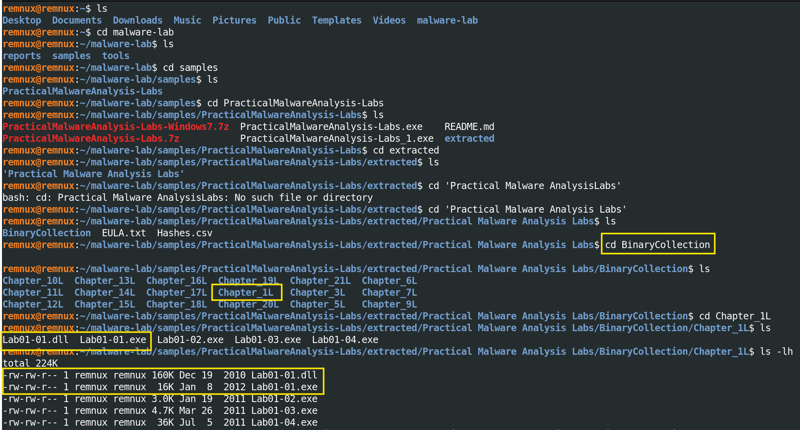
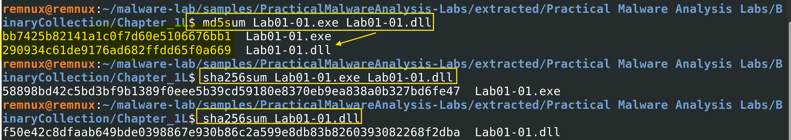
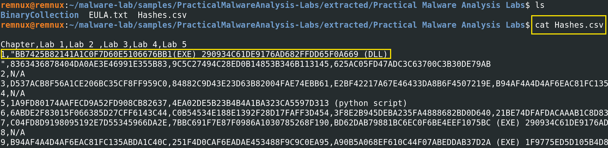
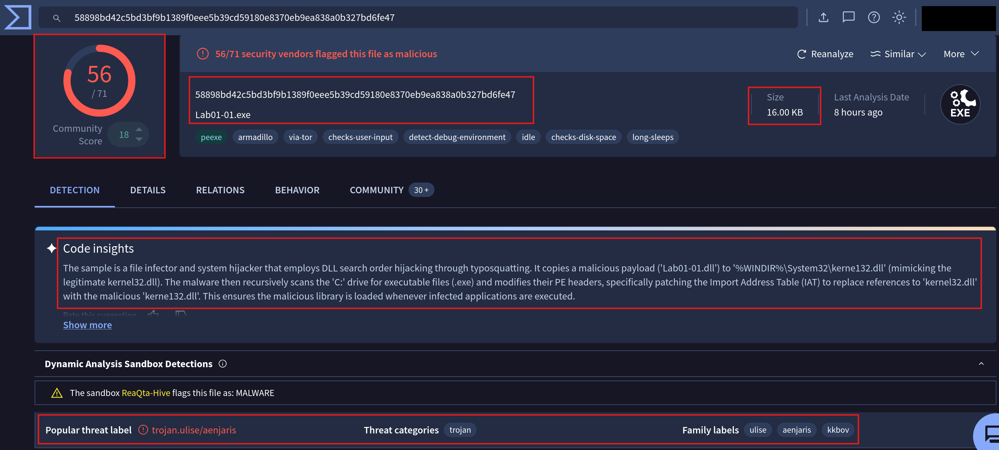
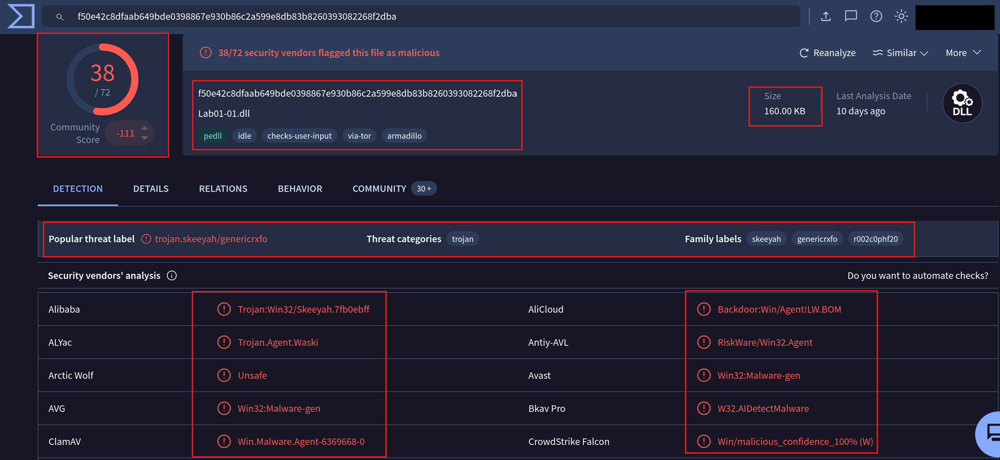
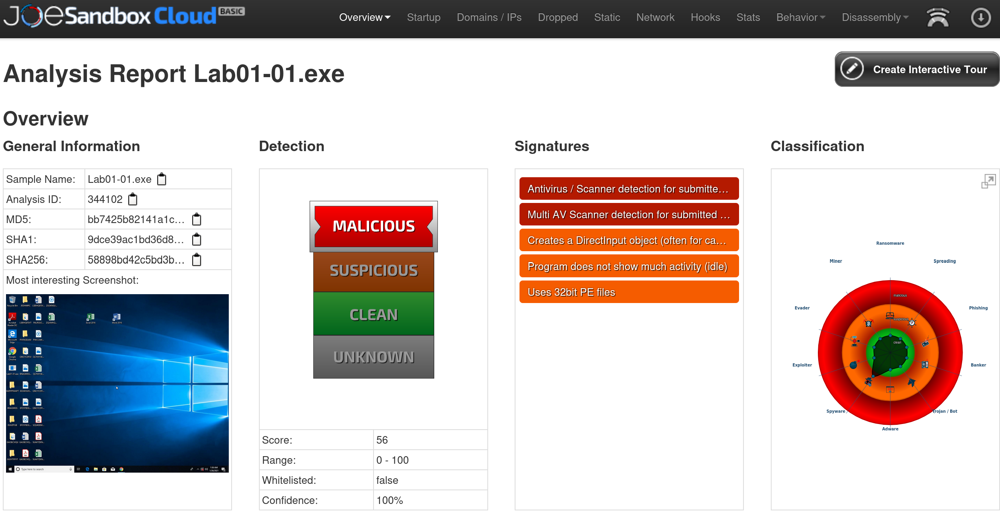
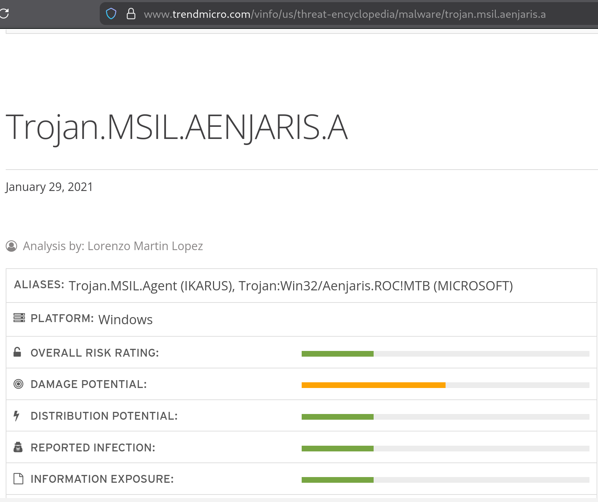

# Lab 02.B — Hash Verification & Threat Intelligence 
**Date:** 29 April 2026
**Author:** Emilio Mardones (Ofendor)
**Status:** ✅ Completed
**Module:** Basic Static Analysis — Sikorski Ch. 1, Module 102
**Related:** [Lab 02a — Sample Acquisition](01-lab-02-sample-acquisition.md) | [Lab 01 Setup Notes](../lab-01-setup/lab-01-setup-notes.md)

---

## 1. Overview

This section showcases my personal malware analysis workflow involving hash verification and threat intelligence research, based on *Practical Malware Analysis*: `Lab01-01.exe` and `Lab01-01.dll`. 
Both files were confirmed malicious, packed with a known **file packer** called `Armadillo`, and the executable is classified as a **Trojan** that uses DLL search order hijacking through `typosquatting` to persist across the infected system. It uses several anti-analysis evasion methods that I'll explain during this lab. 

**Note:** First stage of analysis is overall passive which queries data from external databases only. Deployment will be held in the next repo.

---

## 2. First Analytical step: Hashing 

Before I ran a single analysis tool, the first thing I did was generate cryptographic hashes for both files. This might seem like a superficial step, but it is foundational to everything that follows according to my research and readings.

A cryptographic hash function takes a file as input and produces a fixed-length string which is also known as `fingerprint` which is mathematically unique to that exact sequence of bytes. This is important for you to remember, because these is used nowadays to analyse sequence of bytes against pattern behaviour. 

As Sikorski and Honig (2012) explain in Chapter 1, hashing serves two essential purposes in malware analysis: **sample identification** and **integrity verification**. If even one byte of the file changes, the hash changes completely. This means that once I record the hash, I can prove that I analysed the exact same file and not a corrupted copy or modified variant with the same name.

Bibliography labels it as **chain of custody**, which documents who handled evidence, when, and in what state. Kleymenov and Thabet (2019) describe this as non-negotiable in any  SOC analysis workflow that might produce findings used in a formal context for further research and Threat Intelligence databases,  which helps for active response. 

There is also a practical threat intelligence dimension. VirusTotal, MalwareBazaar, and similar platforms index samples by hash. The MD5 or SHA256 value I generate locally was my search key into global malware databases. Without hashing first, I cannot do the necessary steps that follow.

---

## 3. MD5 and SHA256 Hashes

To start the analysis I positioned myself withing the directory that hold `Chapter_1L` lab items on **REMnux** (`192.168.100.1`) VM.

<div align="center">
  
  <p><em>Use this as a guideline. Note: file Hashes,csv will be used later on, but it is important for you to notice its location right now</em></p>
</div>

**Output confirmed:**

```
total 224K
-rw-rw-r-- 1 remnux remnux 160K Dec 19  2010 Lab01-01.dll
-rw-rw-r-- 1 remnux remnux  16K Jan  8  2012 Lab01-01.exe
-rw-rw-r-- 1 remnux remnux 3.0K Jan 19  2011 Lab01-02.exe
-rw-rw-r-- 1 remnux remnux 4.7K Mar 26  2010 Lab01-03.exe
-rw-rw-r-- 1 remnux remnux  36K Jul  5  2011 Lab01-04.exe
```

Two file size observations are worth noting: `Lab01-01.exe` is only 16 KB, unusually small for a Windows executable. `Lab01-01.dll` is 160 KB which is ten times larger. 
Muralidharan et al. (2022) specifically identify small file size, a small number of **Portable Executable (PE)** sections, and a small number of import functions as heuristic indicators of packed executables, all three of which I expect to confirm when I run PE header analysis on the Static VM. The size disparity between the two files also makes intuitive sense once you understand the relationship between them: *the executable is a dropper/launcher packed down to its minimal stub, and the DLL carries the actual payload*. I will come back to this when I discuss the mechanism.

### Hashing Commands

<div align="center">
  
  </div>

**Output:**

```
bb7425b82141a1c0f7d60e5106676bb1  Lab01-01.exe
290934c61de9176ad682ffdd65f0a669  Lab01-01.dll

58898bd42c5bd3bf9b1389f0eee5b39cd59180e8370eb9ea838a0b327bd6fe47  Lab01-01.exe
f50e42c8dfaab649bde0398867e930b86c2a599e8db83b8260393082268f2dba  Lab01-01.dll
```

I use both MD5 and SHA256 rather than just one. MD5 is faster to type and widely supported across threat intelligence platforms, but SHA256 provides stronger `collision resistance`, meaning it is computationally infeasible for two different files to produce the same SHA256 hash. For formal documentation and threat sharing, SHA256 is the preferred standard, while MD5 remains useful as a quick lookup key. You could run other hashes to analyse output, but for the purpose of this lab kept it simple this way.

---

## 4. Validating Hashes.csv output

As mentioned during step 3, the lab repository includes a `Hashes.csv` containing the expected MD5/ SHA256 values for every lab binary:

**Relevant output from Hashes.csv:**

```
1,"BB7425B82141A1C0F7D60E5106676BB1(EXE) 290934C61DE9176AD682FFDD65F0A669 (DLL)"
```

<div align="center">
  
  </div>

**Result: PASS.** Both samples match the repository's expected values exactly. The files were not corrupted during download or extraction, which is great to jump into the next step.

---

## 5. Threat Intelligence

As a SOC Analyst you need to understand the concept behind Threat Intelligence and its importance. Threat actors can be persistent and they use a variety of tactics and techniques to compromise systems. One Malware alone could deploy several procedures at the same time.  Given the risk these threats present, **NIST SP 800-150 (2016)** points that it is important that organisations share cyber threat information and use it to improve security posture.

Sharing communities help professionals to leverage knowledge, experience and capabilities to gain a complete understanding of the threats the organisations may face. 

After I confirmed the integrity of the samples, I queried VirusTotal and other resources using the SHA256 hash of each file. I used the SHA256 rather than MD5 for this step because it is the more authoritative identifier and reduces any risk of hash collision in the database lookup.

**Note:** I repeat, this is passive intelligence gathering only, I am not submitting the files, only querying by hash. The files never leave REMnux during this step. All information was done from the VM by enabling Adapter 1 with NAT connection. Keep your clipboards and Bidirectional features disable at all time.

---

### 5.1 Virus Total: Lab01-01.exe Analysis

<div align="center">
  
  </div>

**Summary:**

```
SHA256:           58898bd42c5bd3bf9b1389f0eee5b39cd59180e8370eb9ea838a0b327bd6fe47
File name:        Lab01-01.exe
Size:             16.00 KB
Detection:        56/71 security vendors flagged as malicious
Community score:  +18 (confirmed malicious)
Popular label:    trojan.ulise/aenjaris
Threat category:  Trojan
Family labels:    ulise, aenjaris, kkbov
Last analysis:    8 hours ago
```

**Other Indicators of Compromise (IOC) I've considered relevant:**

| Tag                        | Meaning                                                  |
| -------------------------- | -------------------------------------------------------- |
| `peexe`                    | Is a PE executable format that affects Windows systems   |
| `armadillo`                | Packed with Armadillo file packer                        |
| `via-tor`                  | Attempts communication through Tor network               |
| `checks-user-input`        | Waits for mouse/keyboard activity before executing       |
| `detect-debug-environment` | Actively checks for debuggers and analysis tools         |
| `checks-disk-space`        | Queries available disk space as sandbox detection        |
| `long-sleeps`              | Deliberately delays execution to outlast sandbox windows |

This is a significantly more sophisticated mechanism than I was expecting from a Chapter 1 training sample. 

According to the analysis, I've found a file infector and system hijacker that employs DLL search in order to hijack Windows through **typosquatting**. Then, it copies a malicious payload (`Lab01-01.dll`) to `%WINDIR%\System32\kerne132.dll` (note the wrong typo within the name, very smart, right?) by mimicking the legitimate `kernel32.dll`. The malware then recursively scans the C: drive for executable files and modifies their PE headers, specifically patching the Import Address Table (IAT) to replace references to `kernel32.dll` with the malicious `kerne132.dll`. This ensures the malicious library is loaded whenever infected applications are executed.  

**Note:** `kernel32.dll` is a critical 32-bit DLL file in Windows OS that manages essential system tasks such as memory management, input/output operations, and process creation, allowing applications to interact with the OS (Chen R., 2023 - Microsoft Blogs).

---

### 5.2 Virus Total: Lab01-01.dll Analysis

<div align="center">
  
  </div>

**Summary:**

```
SHA256:           f50e42c8dfaab649bde0398867e930b86c2a599e8db83b8260393082268f2dba
File name:        Lab01-01.dll
Size:             160.00 KB
Detection:        38/72 security vendors flagged as malicious, CloudStrike with a                    confident 100%
Community score:  -111 (strongly confirmed malicious)
Popular label:    trojan.skeeyah/genericrxfo
Threat category:  Trojan
Family labels:    skeeyah, genericrxfo, r002c0phf20
Last analysis:    10 days ago (the last time someone queried for this hash)
```

The AliCloud classification of **Backdoor:Win/AgentILW.BOM** is the most curious finding during this analysis. While other classify it as a trojan, the backdoor designation confirms that this DLL provides remote access or command execution capabilities to the attackers once it has been injected into the victim system via Tor as described in the previous `.exe` analysis.

I noticed there was disparities in the detection rate for the DLL compared to the EXE file (38/72 vs 56/71) which was due to the **Armadillo** packing the hackers used. What does this means?: the DLL's malicious code is compressed at rest due to Armadillo capabilities, making signature-based detection harder for analysts. 
Bibliography from **Šťastná and Tomášek (2016)** demonstrated precisely this problem: *packed files can defeat signature-based detection systems even when the underlying malicious code is well known, because the packer transforms the syntactic form of the binary without changing its semantic behaviour*.

---

### 5.3 Anti-Analysis Techniques

Before this lab, I knew anti-analysis techniques existed but seeing them as tags on a real sample made them much more tangible. The five techniques present in Lab01-01.exe represent a layered evasion strategy that every attacker implements:

```
Layer 1 — Packing (Armadillo)
  Code is encrypted at rest
  Signature-based detection fails
  Static analyst sees the packer stub, not the payload

Layer 2 — Debugger detection
  Checks for analysis tools at runtime
  If debugger found → malware exits or behaves differently

Layer 3 — Behaviour durint user interaction
  Waits for real mouse/keyboard activity
  Automated sandboxes often produce no user input
  Malware stays dormant until it detects a human moving the mouse for example

Layer 4 — Disk space check
  Real systems have hundreds of GB used
  Sandboxes often have minimal disk usage
  Low disk space → likely a sandbox → stay dormant (yeah, malwares are not stupid)

Layer 5 — Long sleeps
  Deliberately delays execution
  Most automated sandboxes observe for 2-5 minutes
  Malware waits longer than the observation window which makes unskill analysts to   overall fail their response and tag them as false positives. 
```

Cucci (2024) dedicates substantial coverage to exactly these techniques in *Evasive Malware*, noting that modern malware rarely relies on a single evasion method. The layered approach where each technique independently increases the probability of evading detection, is characteristic of professionally developed malware rather than script-kiddie tools. Now you know why Threat Intelligence gathering is so important during malware analysis.

---

## 6. Other sources: JoeSandbox and TrendMicro

Beyond VirusTotal, I queried two additional platforms to cross-reference findings.

### JoeSandbox Cloud

<div align="center">
  
  </div>

```
Platform:     JoeSandbox Cloud Basic
Sample:       Lab01-01.exe
Analysis ID:  344102
MD5:          bb7425b82141a1c...
Score:        56 / 100
Verdict:      MALICIOUS
Confidence:   100%
Whitelisted:  false
```

**Summary:**

```
→ Creates a DirectInput object (often used for capturing keystrokes)
→ Program does not show much activity if IDLE so remains dormant
   (anti-sandbox: waiting for user interaction)
→ Uses 32-bit PE files (confirming that affects Kerbero132.dll)
```

The DirectInput object creation is interesting because is a Windows API component used by games and applications to capture keyboard and controller input, strongly suggesting **keylogging capability**, which aligns with the backdoor classification seen in the DLL analysis on VirusTotal.

The IDLE signature confirms the user interaction check evasion technique identified in VirusTotal's tags where the sample was observed sitting dormant during the automated analysis, waiting for input that the sandbox did not provide.

---

### TrendMicro Threat Encyclopedia

<div align="center">
  
  </div>

```
Official name:  Trojan.MSIL.AENJARIS.A
Aliases:
  → Trojan.MSIL.Agent (detected by IKARUS)
  → Trojan:Win32/Aenjaris.ROC!MTB (MICROSOFT defender)
Platform:       Windows
Date:           January 29, 2021
Risk ratings:   Damage potential — MEDIUM
                Distribution potential — LOW-MEDIUM
```

The MSIL designation (Microsoft Intermediate Language) in the TrendMicro name is worth noting because it suggests at least part of the malware is compiled from a .NET language such as C#, which has implications for reverse engineering. **.NET** assemblies can often be decompiled back to near-source-code quality making it easier to reverse engineer. This is something I will explore in the static analysis phase.

---

## 7. Key Concepts

During this Lab I encountered several terms that were worth researching to understand malware capabilities. 
### Malware Packers

A packer is a tool that compresses, encrypts, or otherwise transforms an executable so that its original code is not visible in its stored form. When the packed executable runs, the packer's stub code decompresses or decrypts the original code into memory and then transfers execution to it.

Šťastná and Tomášek (2016) describe packing as serving two purposes in malware: *reducing file size (the original commercial use case) and obstructing reverse engineering, signature-based detection, and static analysis*. This nature of packer tools create detection challenges for analysts because both legitimate software and malware use packers, meaning the mere presence of a packer does not confirm malicious intent and it could be ranked as a false positive. So I assume that the results from Virus Total disparity tank pretty much shows 15 vendors that were likely defeated by the Armadillo layer the malware has. This bibliography also found that *81 out of 100 randomly selected harmless software samples were packed by at least one known packing tool, demonstrating that packer detection alone is an unreliable malware indicator*. As a SOC analyst you should never oversee this warnings and take is as expected for further analysis. 

Muralidharan et al. (2022) analysis of 2,000 randomly selected PE files from VirusTotal between 2010 and 2021, show that on average, **21.35% of all PE files** across that period were packed. This is critical to know because the use of packing has increased in recent years as machine learning-based detection mechanisms have become more effective against non-packed malware, pushing threat actors back toward packing as a primary evasion strategy.

This has a direct connection to what I observed in this sample. The **16 KB** file size of `Lab01-01.exe` is itself a packing indicator. Muralidharan et al. (2022) specifically identify *small file size, a small number of PE sections, and a small number of import functions as indicators of packed executables*, all artefacts of the Armadillo packer rather than the actual malicious code.

For the analyst, the immediate consequence is that static analysis of a packed binary reveals the packer stub rather than the malicious code. The actual payload only becomes visible after the sample runs and unpacks itself in memory, which is why dynamic analysis and memory forensics are necessary later in the workflow. Muralidharan et al. (2022) explained that most detection methods in the literature fail entirely when a packer implements runtime evasion routines from which, as the VirusTotal tags confirm, Armadillo does.

Armadillo has been widely adopted by malware authors precisely because of its effectiveness at defeating analysis. Ugarte-Pedrero et al. (2016) classify it at the highest level of packing complexity, describing it as using a techniques that partially reveal code. Unlike simple packers that unpack the entire payload into memory at once, Armadillo decrypts only the specific region of code that is about to execute, then re-encrypts it when execution moves to a different region. This pattern teaches us that even during dynamic analysis, a single execution run may not reveal the complete unpacked code but only the paths that were actually executed during that specific run. 

Particularly effective when combined with the anti-sandbox techniques because the malware detects a sandbox environment and stays dormant in purpose, so Armadillo will never decrypt the payload sections that require user interaction to trigger, leaving those portions of the code completely hidden from the analyst. This is also known as obfuscation.

In practical terms, this means that when I reach the dynamic analysis phase, I will need to account for the Armadillo layer before I can meaningfully analyse the underlying payload and play around other techniques till fully get the information we need to understand this malware.

---

### Typosquatting in Malware?

Yes, **Typosquatting** refers to registering domain names that closely resemble legitimate ones in order to capture traffic from users who misspell for example `gooogle.com` of `google.com`. Kaspersky (n.d.) defines it as a form of cybersquatting that exploits predictable human typing errors to redirect victims to malicious sites.

In malware, the same principle is applied at the file system level. Rather than mimicking a domain name, the malware mimics a critical Windows system file name. In this specific case:

```
Legitimate file: C:\Windows\System32\kernel32.dll
Malicious file:  C:\Windows\System32\kerne132.dll
                                           ↑
                              Letter 'l' replaced with number '1'
```

The visual similarity between lowercase `l` (ell) and the number `1` (one) is the attack vector. A casual glance at a process list or file listing — or a log entry — will not reveal the difference without careful inspection. The malware exploits this visual ambiguity to place its malicious DLL in the same system directory as the legitimate one, making it appear legitimate at a glance.

This technique is significantly more dangerous than a simple file drop because it does not require registry persistence or other traditional persistence mechanisms. By patching the IAT of every executable on the C: drive to load `kerne132.dll` instead of `kernel32.dll`, the malware ensures that its payload is loaded by every application that calls any `kernel32` API — which is effectively every Windows application.

---

### 7.4 What Is DLL Search Order Hijacking?

Windows resolves DLL dependencies using a specific search order. When an application calls `LoadLibrary("kernel32.dll")`, Windows searches for the DLL in a defined sequence of locations: the application directory, the system directory, the Windows directory, and then the directories listed in the PATH environment variable.

DLL search order hijacking exploits this mechanism by placing a malicious DLL with the same name as a legitimate one in a location that appears earlier in the search order. In this sample, the attack is more direct — rather than relying on search order, the malware directly patches the Import Address Table of victim executables to hardcode references to the malicious `kerne132.dll`, bypassing the search order entirely.

Sikorski and Honig (2012) cover this technique in detail in Chapter 11 as one of the primary DLL injection and persistence mechanisms used by Windows malware.

---

### 7.5 What Is IAT Patching?

Every Windows executable contains a data structure called the Import Address Table (IAT). This table records which external DLL functions the program calls and, after Windows loads those DLLs, where in memory those functions are located. When the program calls `CreateFile`, for example, Windows uses the IAT to find the actual memory address of that function in `kernel32.dll`.

The malware in this sample modifies the IAT of victim executables on disk — changing the DLL name entry from `kernel32.dll` to `kerne132.dll`. After this modification, every time the victim executable is launched by Windows, the loader resolves `kernel32` function calls to the malicious DLL instead of the legitimate one. The malicious DLL can then intercept system calls, steal credentials, establish backdoor connections, or perform any other operation before (or instead of) forwarding the call to the real `kernel32.dll`.

The IAT also plays a central role in the unpacking analysis I will need to conduct later. Muralidharan et al. (2022) highlight IAT reconstruction as one of the key technical challenges in unpacking research — many generic unpacking methods fail precisely because they cannot fully rebuild the IAT after the packer has processed it. In their proposed future framework, they identify halting the unpacking routine at the point of IAT reconstruction as the most efficient moment to identify the specific packer used. This is directly relevant to what I will encounter when I attempt to analyse the unpacked payload of this sample during dynamic analysis.

---

## 8. Consolidated IOC Table

The following table consolidates all indicators of compromise identified during this phase. These values can be used for threat hunting, detection rule creation, or threat intelligence sharing.

| Field | Lab01-01.exe | Lab01-01.dll |
|---|---|---|
| **MD5** | `bb7425b82141a1c0f7d60e5106676bb1` | `290934c61de9176ad682ffdd65f0a669` |
| **SHA256** | `58898bd42c5bd3bf9b1389f0eee5b39cd59180e8370eb9ea838a0b327bd6fe47` | `f50e42c8dfaab649bde0398867e930b86c2a599e8db83b8260393082268f2dba` |
| **File size** | 16 KB | 160 KB |
| **File type** | PE32 EXE | PE32 DLL |
| **VT detection** | 56/71 | 38/72 |
| **Threat label** | trojan.ulise/aenjaris | trojan.skeeyah/genericrxfo |
| **Classification** | Trojan / File Infector | Backdoor / Trojan |
| **Packer** | Armadillo | Armadillo |
| **Anti-analysis** | Debugger detection, user interaction check, disk space check, long sleeps | Not individually identified |
| **Network** | Tor communication attempted | — |
| **Mechanism** | IAT patching + DLL typosquatting | Backdoor payload (kerne132.dll) |
| **TrendMicro name** | Trojan.MSIL.AENJARIS.A | — |
| **Microsoft name** | Trojan:Win32/Aenjaris.ROC!MTB | — |
| **JoeSandbox score** | 56/100 MALICIOUS (100% confidence) | — |
| **Integrity check** | ✅ PASS vs Hashes.csv | ✅ PASS vs Hashes.csv |

**Additional file system IOC identified:**

```
Dropped file:  %WINDIR%\System32\kerne132.dll
               (typosquatted copy of Lab01-01.dll)

Affected:      All .exe files on C:\ drive
               (IAT patched to reference kerne132.dll)
```

---

## 9. Safety Observations for Next Phases

The intelligence gathered in this phase has direct implications for how I will handle these samples going forward.

The file infector behaviour — recursively scanning the C: drive and patching every `.exe` — means this sample is significantly more dangerous in a live Windows environment than a typical trojan. A standard trojan establishes persistence in one or two locations. This sample contaminates every executable on the system. If it were executed on the Windows Static VM without adequate snapshot discipline, the VM would be unusable for further analysis and every subsequent sample analysed on it could be affected.

The Armadillo packing layer adds another consideration. Muralidharan et al. (2022) note that when packed files implement runtime evasion routines — which this sample demonstrably does — most automated unpacking and detection approaches fail entirely. This means I cannot rely on standard automated tools alone during dynamic analysis. Manual intervention at key execution points, and careful monitoring of the IAT reconstruction phase, will be necessary to get at the actual payload.

My protocol for the next phases:

```
Static VM (192.168.100.10):
  ✅ Static analysis only — no execution
  ✅ Pre-analysis snapshot taken before sample arrives
  ✅ Restore snapshot after every session

Dynamic VM (192.168.100.20):
  ✅ Execution environment only
  ✅ Snapshot taken before every execution run
  ✅ Restore to clean snapshot immediately after
  ✅ Never reuse a contaminated dynamic VM session
  ✅ Account for Armadillo unpacking phase before payload analysis
```

The Armadillo packer also means that string extraction and PE header analysis on the Static VM will reveal packer stub artefacts rather than the actual payload strings. This is expected and documented — it will become a lesson in recognising packed versus unpacked binaries during the static analysis phase. Muralidharan et al. (2022) further caution that entropy-based detection alone is insufficient, as approximately 31.5% of low-entropy malicious PE files are in fact packed — meaning a low entropy score does not guarantee an unpacked binary.

---

## 10. Self-Reflection

I went into this phase expecting a straightforward hash check followed by a simple VirusTotal lookup. I came out of it having documented five distinct anti-analysis techniques, two complex persistence mechanisms, a commercial-grade packer, and a file infector that contaminates every executable on a system. That gap between expectation and reality is itself a lesson.

The most valuable thing I learned in this phase is how much intelligence is available before executing a single instruction. Sikorski and Honig (2012) emphasise this throughout Chapter 1 — static analysis is not a preliminary step before the "real" analysis, it is a complete analytical discipline in its own right. The VirusTotal Code Insights description of the IAT patching mechanism told me more about this sample's behaviour than most basic dynamic analysis runs would have revealed, and it did so with zero execution risk.

The anti-analysis techniques also gave me a preview of what Cucci (2024) calls the adversarial relationship between malware authors and analysts. The sample is not just malicious — it is actively trying to prevent me from understanding it. The Armadillo packer hides the code. The debugger detection watches for my tools. The user interaction check waits for evidence that a real human is present. The disk space check looks for sandbox fingerprints. The long sleeps outlast automated analysis windows. Each of these is a direct countermeasure against a specific analytical technique. Understanding them as a layered defence — rather than individual quirks — is the mindset shift this phase gave me.

One thing I would do differently: I should have queried the DLL on JoeSandbox separately rather than focusing only on the EXE. The backdoor classification from AliCloud for the DLL is significant, and a dedicated sandbox run of the DLL would likely reveal additional behavioural signatures. I will make sure to give both files equal treatment in the dynamic analysis phase.

---

## 11. References

Cucci, K. (2024). *Evasive malware: A field guide to detecting, analyzing, and defeating advanced threats*. No Starch Press.

Kaspersky. (n.d.). *What is typosquatting?* Kaspersky Resource Center. https://www.kaspersky.com/resource-center/definitions/what-is-typosquatting

Kleymenov, A., & Thabet, A. (2019). *Mastering malware analysis: The complete malware analyst's guide to combating malicious software, APT, cybercrime, and IoT attacks*. Packt Publishing.

Muralidharan, T., Cohen, A., Hajaj, A., & Zilberman, P. (2022). File packing from the malware perspective: Techniques, analysis approaches, and directions for enhancements. *ACM Computing Surveys*, *55*(5), Article 108. https://doi.org/10.1145/3530810

Sikorski, M., & Honig, A. (2012). *Practical malware analysis: The hands-on guide to dissecting malicious software*. No Starch Press.

Šťastná, J., & Tomášek, M. (2016). The problem of malware packing and its occurrence in harmless software. *Acta Electrotechnica et Informatica*, *16*(3), 41–47. https://doi.org/10.15546/aeei-2016-0022

Trend Micro. (2021, January 29). *Trojan.MSIL.AENJARIS.A*. Trend Micro Threat Encyclopedia. https://www.trendmicro.com/vinfo/us/threat-encyclopedia/malware/trojan.msil.aenjaris.a

Ugarte-Pedrero, X., Balzarotti, D., Santos, I., & Bringas, P. G. (2016). RAMBO: Run-time packer analysis with multiple branch observation. In *Proceedings of the 13th Conference on Detection of Intrusions and Malware & Vulnerability Assessment (DIMVA 2016)*. https://s3.eurecom.fr/docs/dimva16_multiunpack.pdf

---

*Next entry: [Lab 02c — Static Analysis: File Triage and PE Header Inspection](03-lab-02-static-analysis-file-triage.md)*
*Previous entry: [Lab 02a — Sample Acquisition](01-lab-02-sample-acquisition.md)*