# Lab 02c — SIEM Integration & Network Simulation Setup

**Date:** 01–20 May 2026

**Status:** ✅ Completed

**Module:** Lab Infrastructure — SIEM, Fake Internet, DNS Interception

**Related:** [Lab 02b — Hash Verification & Threat Intelligence](02b-hash-verification.md) | [Lab 03 — Static Analysis: String Extraction](../lab-03-static-analysis/03-string-extraction.md)

---
## 1. Overview
This detailed repository covers the infrastructure additions I made to the malware analysis lab before dynamic analysis begins. Two major components were added:

- **Wazuh SIEM** — a dedicated Ubuntu 24 LTS VM running the Wazuh SIEM (manager, indexer, dashboard). Agents were deployed on both Windows FLARE-VM machines to monitor file integrity, registry changes, process creation, and network events in real time. The goal is to create a proper SOC environment.

- **Fake Internet** — REMnux was configured to simulate internet services using INetSim (HTTP, HTTPS, SMTP, FTP) and DNSChef (DNS interception). Every domain the malware queries resolves back to REMnux IP Address, and every HTTP/HTTPS connection receives a fake response — all without any real internet access from the Windows VMs.

This infrastructure is not optional. Without it, malware executed on the Dynamic VM would either fail (no DNS response), behave differently (since it has anti-sandbox checkers), or produce incomplete forensic evidence. With it, every network attempt is logged, every file change is alerted, and every DNS query is captured.

---
## 2. SOC infrastructure
When Lab01-01.exe executes during dynamic analysis, the following sequence will occur:
 
```

Malware queries: "where is my C2 server?"

DNSChef intercepts → returns REMnux VM IP address

Malware connects via HTTP to [REMnux VM IP address]:80

INetSim responds with fake HTTP content

Wazuh agent detects:

  → new file created in System32 (kerne132.dll)

  → IAT patching of executables

  → network connection attempt

  → registry modification

All events forwarded to Wazuh dashboard at [Dynamic VM IP address]
All events get registered on Wireshark running silently 
in the background on REMnux

```
  
---
## 3. Final Lab Topology

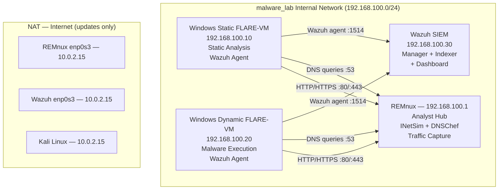

  *Figure 1. Final lab network topology with Wazuh SIEM and fake internet services.*

 ---
## 4 — Wazuh SIEM Setup

### 4.1.1 Installation

Wazuh was installed on a dedicated **Ubuntu 24.04 LTS VM** (4GB RAM, hostname `wazuh-siem`).  

<div align="center">
  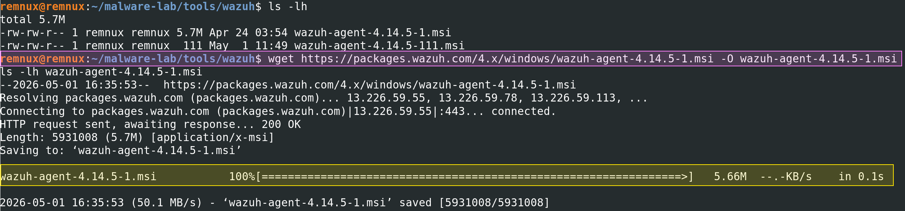
  </div>

```bash

curl -sO https://packages.wazuh.com/4.14/wazuh-install.sh && sudo bash ./wazuh-install.sh -a

```

After installation, disable the Wazuh repository to prevent unintended updates:

```bash

sed -i "s/^deb /#deb /" /etc/apt/sources.list.d/wazuh.list

apt update

```

<div align="center">
  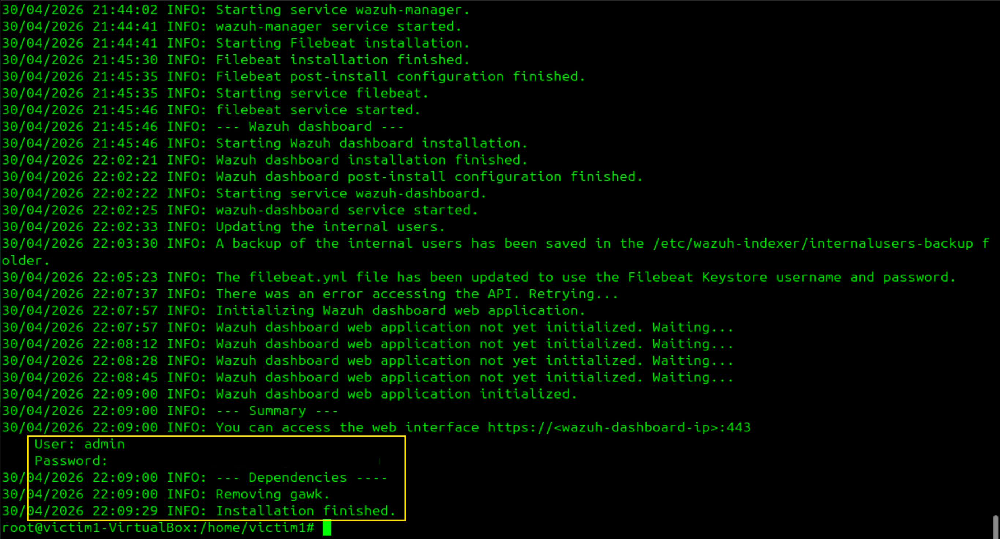
  <p><em>⚠️ Save the generated password immediately. It is only shown once.</em></p>
</div>
  
---
### 4.1.2 Network Configuration

The Wazuh VM requires two network adapters:

- **Adapter 1 (enp0s3):** NAT for internet access during installation and updates

- **Adapter 2 (enp0s8):** Internal network `malware_lab` for agent/VM communication

After adding Adapter 2 in VirtualBox, configure it using NetworkManager:

```bash
nmcli connection show # Check available connection names

# Fix current ethernet connection to use DHCP instead (removes any static IP assigned by GUI like APIPA)
sudo nmcli connection modify "Profile 1" 802-3-ethernet.mac-address ""
sudo nmcli connection modify "Profile 1" ipv4.method auto ipv4.addresses "" ipv4.gateway "" ipv4.dns ""
sudo nmcli connection up "Profile 1"

# Configure ethernet with static IP for internal network. NOTE: showed enp0s8 is default VM configuration, you might encounter similar or different set up. To know yours use ip addr, then proceed with the commands below
sudo nmcli connection modify "netplan-enp0s8" 802-3-ethernet.mac-address ""
sudo nmcli connection modify "netplan-enp0s8" ipv4.method manual ipv4.addresses "192.168.100.30/24" ipv4.gateway "" ipv4.dns ""
sudo nmcli connection up "netplan-enp0s8"
```

 <div align="center">
  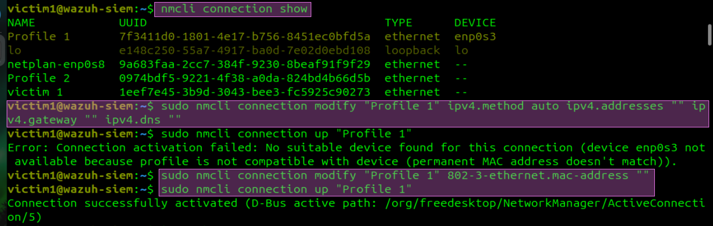
  <p></div>
 <div align="center">
  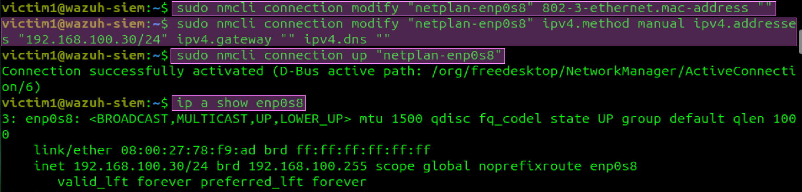
  <p></div>
Verify:
```bash
ip a show enp0s3   # should show 10.0.2.15/24
ip a show enp0s8   # should show 192.168.100.30/24
ip route show      # default via 10.0.2.2 dev enp0s3 only
```

 <div align="center">
  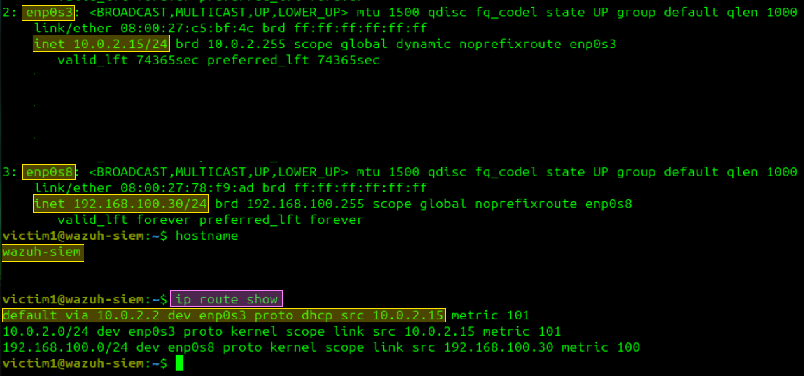
  <p></div>
 
---
### 4.1.3 Firewall Rules

 There is some ports that must be enabled so basic Wazuh agents can connect and communicate with Dynamic/ Static VMs. You can enabled as many agents you want, but this is for learning purposes only, lets keep it simple.

```bash
sudo ufw allow 443/tcp    # dashboard
sudo ufw allow 1514/tcp   # agent communication
sudo ufw allow 1514/udp   # agent communication
sudo ufw allow 1515/tcp   # agent enrollment
sudo ufw allow 55000/tcp  # Wazuh API
sudo ufw enable
sudo ufw status numbered
```

 <div align="center">
  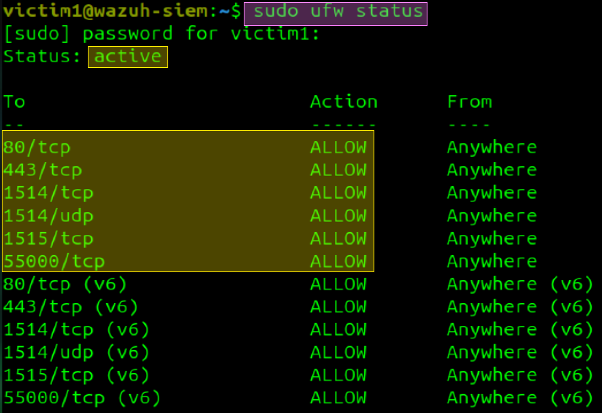
  <p></div>
---
### 4.1.4 Service Verification

Fix systemd timeout before starting services (Wazuh takes longer than the default timeout):

```bash
sudo mkdir -p /etc/systemd/system/wazuh-manager.service.d
sudo nano /etc/systemd/system/wazuh-manager.service.d/timeout.conf
```

 Add:

```ini
[Service]
TimeoutStartSec=180
```

 <div align="center">
  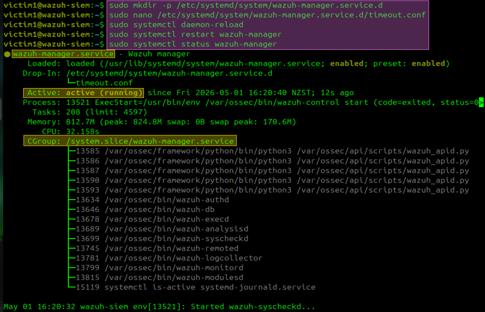
  <p></div>

```bash
# This will ensure Wazuh services are active and running
sudo systemctl daemon-reload
sudo systemctl restart wazuh-manager
sudo systemctl status wazuh-manager
```

 Verify all four services are running:

```bash
sudo systemctl status wazuh-indexer
sudo systemctl status wazuh-dashboard
sudo systemctl status filebeat
```

 <div align="center">
  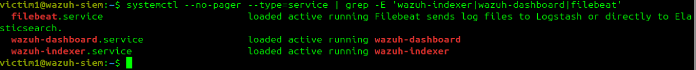
  <p></div>
  
Fix NTP sync (required for agent communication):

```bash
sudo timedatectl set-ntp true
sudo timedatectl status
```

Access the dashboard from within the Wazuh VM browser:

```
https://127.0.0.1:443
Username: admin
Password: <your generated password>
```

<div align="center">
  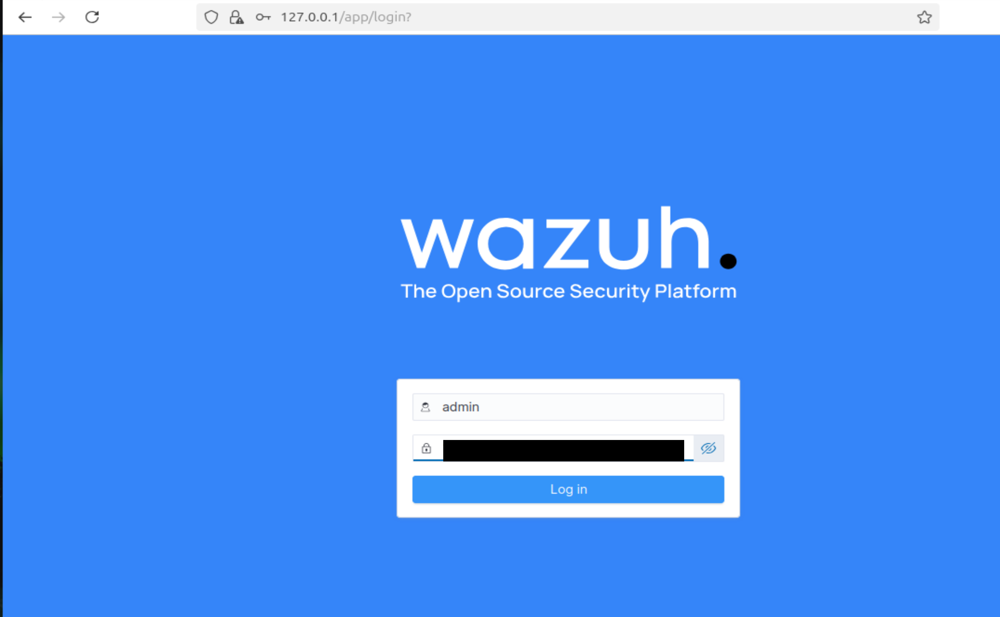
  <p></div>
  
---
## 5. WAZUH Agent Deployment
### 5.1. Agent Deployment in Windows Static VM

The Windows FLARE-VMs have no internet access. The agent installer must be downloaded on REMnux and deployed via the Wazuh dashboard wizard. By following these steps you will connect both VMs to your Wazuh dashboard from which you will be able to analyse their behaviour using a SIEM tool. 

**Step 1 — Enable NAT temporarily on Windows Static VM**

**Step 2 — In Wazuh dashboard**

```
Endpoints → Deploy new agent
→ WINDOWS → MSI 32/64 bits

# Use your REMnux IP address
→ Server address: [IP address]

# I used this name but you can add any you want
→ Agent name: Static-WindEt10-FLARE

→ Copy the generated PowerShell command showed below into your Static VM PowerShell terminal. Use these screenshots as guideline.
```

<div align="center">
  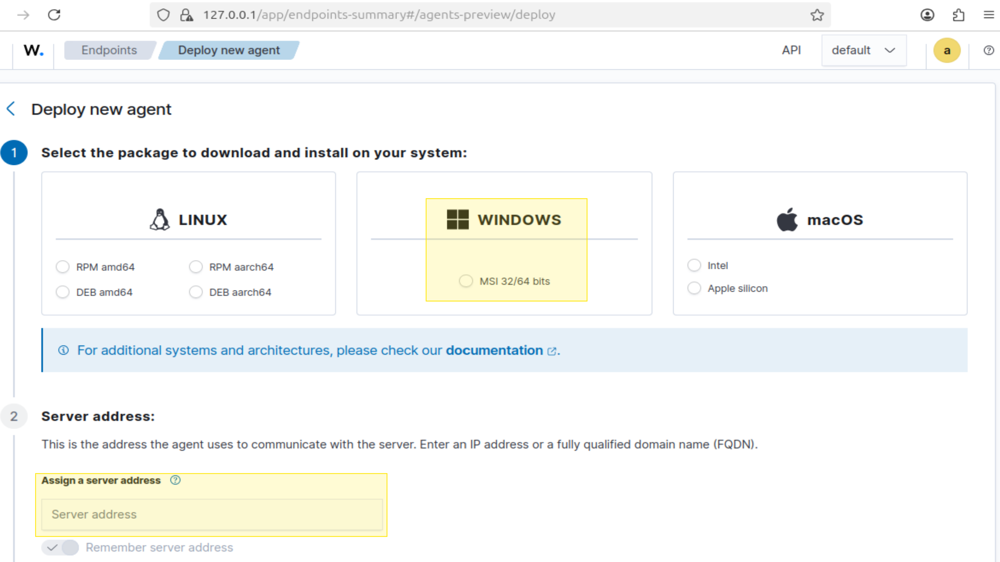
  <p></div>
<div align="center">
  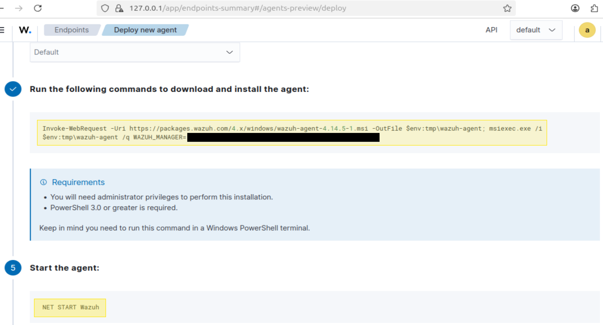
  <p></div>
  
**Step 3 — Run on Windows Static VM PowerShell as Administrator**

<div align="center">
  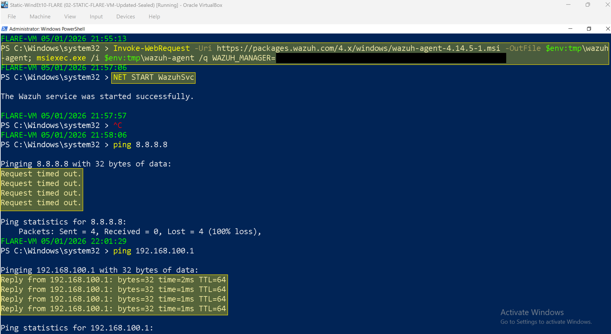
  <p></div>

**Step 4 — Fix the manager IP in the config file**

The installer leaves a placeholder in the config. Replace it:

```powershell
(Get-Content "C:\Program Files (x86)\ossec-agent\ossec.conf") -replace '<WAZUH_MANAGER_IP>', '#PUT HERE REMNUX IP ADDRESS#' | Set-Content "C:\Program Files (x86)\ossec-agent\ossec.conf"
```

<div align="center">
  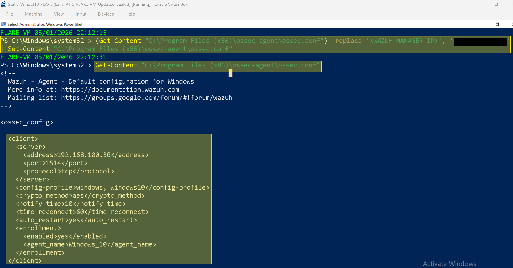
  <p></div>

 Fix the agent name only if you need it via:

```powershell
(Get-Content "C:\Program Files (x86)\ossec-agent\ossec.conf") -replace '<agent_name>Windows_10</agent_name>', '<agent_name>Static-WindEt10-FLARE</agent_name>' | Set-Content "C:\Program Files (x86)\ossec-agent\ossec.conf"
```

Verify both changes:

```powershell

Select-String -Path "C:\Program Files (x86)\ossec-agent\ossec.conf" -Pattern "address|agent_name"

```

**Step 5 — Start the agent**

```powershell
NET START WazuhSvc
Get-Service WazuhSvc
```

<div align="center">
  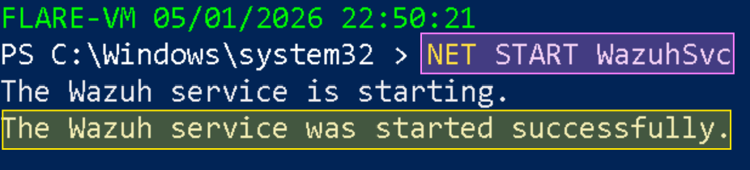
  <p></div>
**Step 6 — Disable NAT on Windows Static VM**

**Step 7 — Verify agent is connected**

```powershell
Get-Content "C:\Program Files (x86)\ossec-agent\ossec.log" -Tail 10
```

Expected:

<div align="center">
  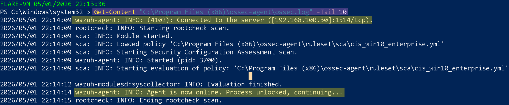
  <p></div>

---
### 5.2 Agent Deployment — Windows Dynamic VM

Repeat Section 5.1 with the following differences:

- Agent name: `Dynamic-WinEt10-FLARE`
- Target IP: Your Dynamic VM Ip address you assigned manually

Fix agent name in config:

```powershell
(Get-Content "C:\Program Files (x86)\ossec-agent\ossec.conf") -replace '<agent_name>Windows_10</agent_name>', '<agent_name>Dynamic-WinEt10-FLARE</agent_name>' | Set-Content "C:\Program Files (x86)\ossec-agent\ossec.conf"
```

<div align="center">
  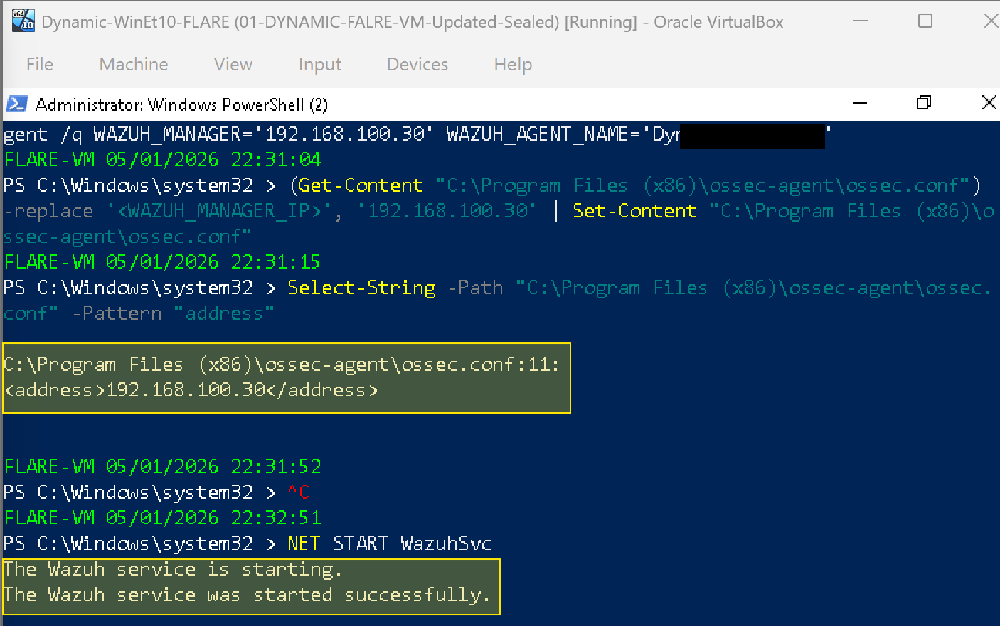
  <p></div>

---
## 6. Dashboard Verification

**Machines that must be ON:** Wazuh VM, Windows Static VM, Windows Dynamic VM

In the Wazuh dashboard at `https://127.0.0.1:443`:

```
Agents management → Summary
```

Expected:

<div align="center">
  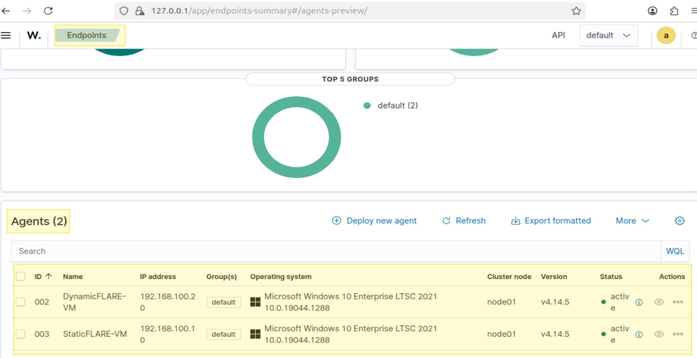
  <p></div>

This confirms that both Dynamic and Static VMs are connected to Wazuh SIEM Dashboard and the agents are on alert mode for any suspicious behaviour occurring during malware analysis. This will add extra information to the purpose of this lab.

---
## 7. Faking NAT connectivity 

### 7.1 - INetSim Setup

INetSim simulates HTTP, HTTPS, SMTP, FTP and other internet services on REMnux. When malware attempts network connections, INetSim responds with convincing fake content while keeping malware active long enough to observe its full behaviour.

Three values must be set in `/etc/inetsim/inetsim.conf`:


```bash
# This enables DNS service
sudo sed -i 's/#start_service dns/start_service dns/' /etc/inetsim/inetsim.conf

# Set bind address to internal lab IP [your REMnux IP address]
sudo sed -i 's/#service_bind_address\t10.10.10.1/service_bind_address\t192.168.100.1/' /etc/inetsim/inetsim.conf

# Set DNS default response IP
sudo sed -i 's/#dns_default_ip\t\t10.10.10.1/dns_default_ip\t\t192.168.100.1/' /etc/inetsim/inetsim.conf
```

 Verify all three changes:

```bash
grep -E "start_service dns|service_bind_address|dns_default_ip" /etc/inetsim/inetsim.conf | grep -v "^#"
```

  

Expected:

<div align="center">
  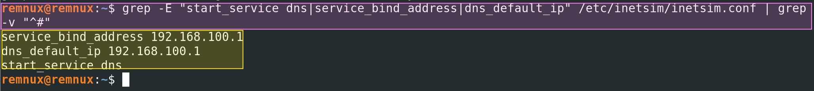
  <p></div>  
  
Start INetSim:

```bash
sudo inetsim --log-dir /var/log/inetsim --report-dir /var/log/inetsim
```

Expected:

<div align="center">
  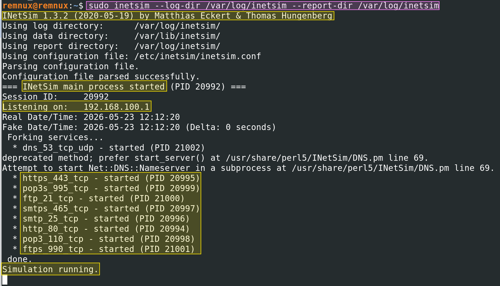
  <p></div>    

---
### 7.2 Known INETsim Issue: DNS simulation failures

INetSim's DNS service uses a deprecated Perl method that fails silently on current versions of Ubuntu or 24 LTS due to a `Net::DNS::Nameserver` compatibility issue. The DNS process starts but exits immediately without binding to port 53. Dynamic and Static machine won't be able to drop successful results after `nslookup`.

**Symptoms:**

- INetSim reports `dns_53_tcp_udp - started` but the process disappears from `ps aux`

- `ss -tulnp | grep 53` returns no output

- DNS queries from Windows VMs time out after `nslookup` check

<div align="center">
  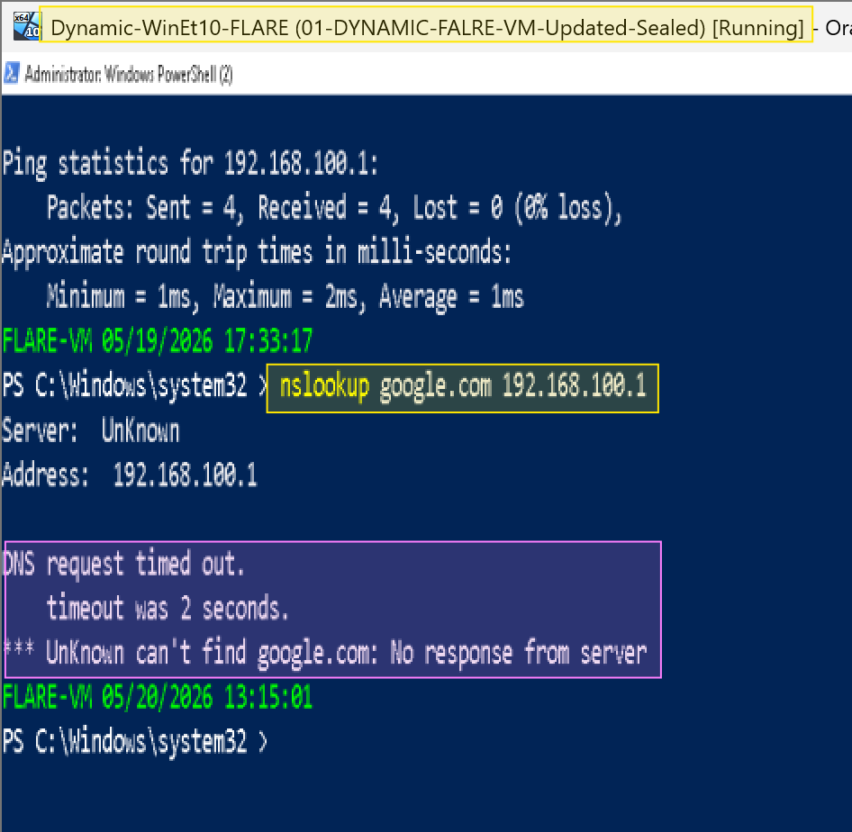
  <p></div> 

**Solution:** Use **DNSChef** for DNS interception instead (see instructions belw). INetSim handles all other services correctly.

---
## 8. DNSChef Setup: DNS simulation

https://github.com/iphelix/dnschef

DNSChef is a DNS proxy tool that intercepts all DNS queries and returns a specified IP address. It is used in place of INetSim's broken DNS service.

### 8.1 Installation


```bash
# Disable systemd-resolved to free port 53
sudo systemctl stop systemd-resolved
sudo systemctl disable systemd-resolved

# Restore internet DNS for REMnux itself
echo "nameserver 8.8.8.8" | sudo tee /etc/resolv.conf

# Clone DNSChef from GitHub
cd ~/malware-lab/tools
git clone https://github.com/iphelix/dnschef.git
cd dnschef

# Fix ownership
sudo chown -R remnux:remnux ~/malware-lab/tools/dnschef

# Create virtual environment and install dependencies
python3 -m venv venv
source venv/bin/activate
pip install -r requirements.txt
```

Verify installation:

```bash
venv/bin/python dnschef.py --help | head
```

  
### 8.2 Running DNSChef

DNSChef must be run as root to bind to port 53:

```bash
cd ~/malware-lab/tools/dnschef
source venv/bin/activate

# safe version without calling sudo su
sudo /home/remnux/malware-lab/tools/dnschef/venv/bin/python /home/remnux/malware-lab/tools/dnschef/dnschef.py --interface 192.168.100.1 --fakeip 192.168.100.1
```

Expected:

<div align="center">
  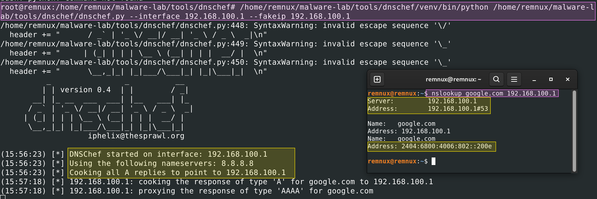
  <p></div>   

When a Windows VM queries any domain, DNSChef logs:

 <div align="center">
  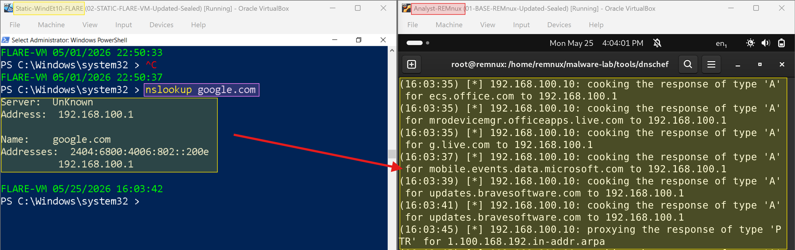
  <p></div>    
 ---

## 9. Lab Startup Script

To avoid manually starting INetSim and DNSChef every session, a startup script was created at `~/malware-lab/tools/start-lab.sh`:

```bash
#!/bin/bash
echo "[*] Starting INetSim..."

sudo pkill -f inetsim 2>/dev/null

sudo rm -f /var/run/inetsim.pid

sudo inetsim --log-dir /var/log/inetsim --report-dir /var/log/inetsim &

sleep 3

echo "[*] Starting DNSChef..."

cd ~/malware-lab/tools/dnschef

source venv/bin/activate

sudo venv/bin/python dnschef.py --interface 192.168.100.1 --fakeip 192.168.100.1 &

echo "[*] Lab ready."
```

  

Make it executable:

  

```bash

chmod +x ~/malware-lab/tools/start-lab.sh

```

  

Run at the start of every dynamic analysis session:

  

```bash

~/malware-lab/tools/start-lab.sh

```

  

---

  

## 8. Verification Tests

  

Before any dynamic analysis, run these tests to confirm the infrastructure is working.

  

**Machines that must be ON:** REMnux (INetSim + DNSChef running), Windows Dynamic VM

  

### DNS Interception Test

  

**Machine: Windows Dynamic VM — PowerShell**

  

```powershell

nslookup google.com 192.168.100.1

```

  

Expected:

```

Server:   192.168.100.1

Name:     google.com

Address:  192.168.100.1

```

  

### HTTP Fake Response Test

  

**Machine: Windows Dynamic VM — PowerShell**

  

```powershell

Invoke-WebRequest -Uri http://192.168.100.1 -UseBasicParsing

```

  

Expected: HTML response from INetSim fake server.

  

### Wazuh Agent Status Test

  

**Machine: Wazuh VM browser**

  

```

https://127.0.0.1:443 → Agents management → Summary

```

  

Expected: Both agents showing Active status.

  

### Network Isolation Test

  

**Machine: Windows Dynamic VM — PowerShell**

  

```powershell

ping 8.8.8.8

```

  

Expected: Request timed out — no real internet access.

  

> 📸 **Screenshot:** Capture all four verification tests in sequence. These prove the lab is ready for dynamic analysis.

  

---

  

## 9. Self-Reflection

  

This was the most technically challenging phase of the lab so far, and also the most educational.

  

The network troubleshooting was frustrating in places — the Wazuh VM subnet mask typo (`/32` instead of `/24`), the five conflicting netplan files generated by mixing the GUI with CLI tools, and the stale static route that silently dropped all packets. Each failure reinforced the same lesson: in network troubleshooting, always check `ip route show` before assuming anything else is wrong. Routing issues are invisible at the firewall level and at the application level — they only show up when you examine the routing table directly.

  

The INetSim DNS issue was particularly interesting from a research perspective. The deprecation of `Net::DNS::Nameserver`'s subprocess API in newer Perl versions is a known upstream issue that REMnux has not yet patched for Ubuntu 24. Discovering this through the Perl warning output — `deprecated method; prefer start_server()` — and then solving it by substituting DNSChef was a practical example of the kind of tool substitution that real analysts do constantly. Tools break, APIs change, and the analyst adapts.

  

What I will do differently next time is establish the full network simulation stack and verify it with tcpdump before attempting to install agents. The tcpdump output that showed DNS queries arriving at REMnux from both Windows VMs was the most useful diagnostic of the entire session — it proved the network was fine and narrowed the problem to the DNS service specifically. Starting with packet capture would have saved significant time.

  

---

  

## 10. References

  

Cucci, K. (2024). *Evasive malware: A field guide to detecting, analyzing, and defeating advanced threats*. No Starch Press.

  

Kleymenov, A., & Thabet, A. (2019). *Mastering malware analysis: The complete malware analyst's guide to combating malicious software, APT, cybercrime, and IoT attacks*. Packt Publishing.

  

Sikorski, M., & Honig, A. (2012). *Practical malware analysis: The hands-on guide to dissecting malicious software*. No Starch Press.

  

Wazuh Inc. (2024). *Wazuh documentation: Installation guide*. https://documentation.wazuh.com/current/installation-guide/index.html

  

Wazuh Inc. (2024). *Deploying Wazuh agents on Windows endpoints*. https://documentation.wazuh.com/current/installation-guide/wazuh-agent/wazuh-agent-package-windows.html

  

---

  

*Next entry: [Lab 03 — Static Analysis: String Extraction](../lab-03-static-analysis/03-string-extraction.md)*

*Previous entry: [Lab 02b — Hash Verification & Threat Intelligence](02b-hash-verification.md)*


---

  
