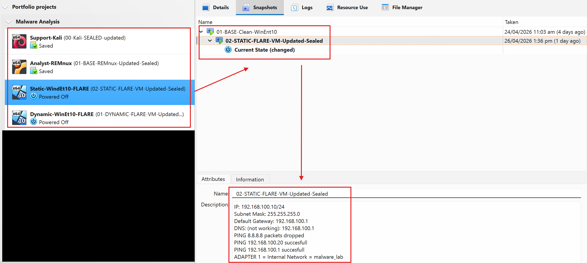
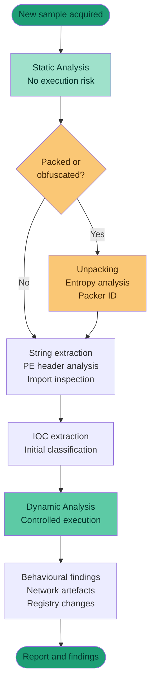
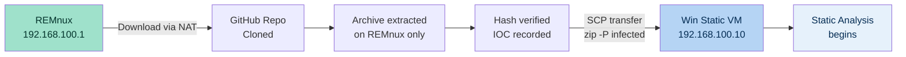

# Lab 02 — Basic Static Analysis: Sample Acquisition
**Date:** 26 April 2026
**Author:** Emilio Mardones (Ofendor)
**Status:** 🔄 In Progress
**Module:** Basic Static Analysis — Sikorski Ch. 1, Module 102
**Folder:** `malware-analysis/02-basic-static-analysis/`
**Related:** [Lab 01 Setup Notes](../lab-setup/lab-01-setup-notes.md) | [Lab 01 Troubleshooting Log](../lab-setup/lab-01-troubleshooting-log.md)

---

## Table of Contents

1. [Overview and Context](#1-overview-and-context)
2. [Why Basic Static Analysis Comes First](#2-why-basic-static-analysis-comes-first)
3. [Sample Source Selection and Rationale](#3-sample-source-selection-and-rationale)
4. [Phase 3 — Sample Acquisition](#4-phase-3--sample-acquisition)
   - 4.1 [Lab Directory Structure Setup](#41-lab-directory-structure-setup)
   - 4.2 [Cloning the PMA Repository](#42-cloning-the-pma-repository)
   - 4.3 [Troubleshooting — First Extraction Attempt (7zip)](#43-troubleshooting--first-extraction-attempt-7zip)
   - 4.4 [Troubleshooting — Second Extraction Attempt (unrar wrong syntax)](#44-troubleshooting--second-extraction-attempt-unrar-wrong-syntax)
   - 4.5 [Successful Extraction](#45-successful-extraction)
   - 4.6 [Sample Confirmation](#46-sample-confirmation)
5. [Phase 4 — Hash Verification](#5-phase-4--hash-verification)
6. [Phase 5 — Transfer to Windows Static VM](#6-phase-5--transfer-to-windows-static-vm)
7. [Self-Reflection](#7-self-reflection)
8. [References](#8-references)

---

## 1. Overview and Context

This is my second lab entry in the `malware-analysis` repository. If you have not read Lab 01 yet, I recommend going through both the [setup notes](../lab-setup/lab-01-setup-notes.md) and the [troubleshooting log](../lab-setup/lab-01-troubleshooting-log.md) first, since this entry builds directly on that foundation, specially the isolated lab network and the VirtualBox snapshot system established there.

At this point, the lab environment is fully configured and confirmed working. The next logical step before touching any analysis tool is getting a real malware sample onto the analysis machine in a controlled, documented, and verifiable way. That *sample acquisition* would be covered in full, including the wrong turns I took along the way.

This lab entry corresponds to **Sikorski and Honig's (2012) Chapter 1** of *Practical Malware Analysis* and to **Module 102** of my current study track. The module focuses on basic static analysis, which Sikorski and Honig (2012) describe as the first line of investigation: *examining a file without executing it in order to extract as much intelligence as possible before any risk of code execution is introduced into the environment*. Sample acquisition is the gate before that gate where nothing gets analysed until it arrives safely. You current set up should look like this, including all saved snapshots:

<div align="center">
  
  <p><em>Use this as a guideline. Make sure you write down important notes to describe each Snapshot</em></p>
</div>

---

## 2. Why Basic Static Analysis Comes First

Before I describe what I did, it's worth understanding *why* we start with static analysis rather than just running the file and watching what happens. This matters for the portfolio because it demonstrates that I am not just following steps blindly — I understand the reasoning behind the methodology.

Static analysis means examining a binary without executing it. As Sikorski and Honig (2012) explain, this technique allows an analyst to extract preliminary indicators of compromise (IOCs), understand file structure, and identify potential capabilities — all without ever triggering the malware's payload. This is significant for two reasons: it is safe, and it is fast. The analyst can often determine within minutes whether a file is suspicious, what kind of threat family it belongs to, and what Windows APIs it intends to use — before making any execution decision.

Kleymenov and Thabet (2019) offer a complementary perspective in *Mastering Malware Analysis*, noting that the distinction between static and dynamic analysis is not merely procedural but epistemological: static analysis tells you *what the code says*, while dynamic analysis tells you *what the code does*. Both are needed for a complete picture, but static always comes first precisely because it carries zero execution risk. You do not detonate a bomb to learn what it is made of.

The academic literature reinforces this. Sihwail et al. (2018) describe static analysis as the foundational pillar of the malware analysis pipeline, noting that it encompasses file format analysis, string extraction, import/export table inspection, and entropy measurement — all of which feed into more advanced techniques later. Similarly, Al-Difallah et al. (2022) observe that despite the limitations of static analysis against obfuscated samples, it remains the first-response technique in both enterprise security operations and academic research environments because of its speed and safety profile.

Cucci (2024) pushes this further in *Evasive Malware*, specifically noting that even evasive, sophisticated malware families leave detectable static fingerprints that a trained analyst can identify before execution. This is particularly relevant for my progression because the samples I will work with initially are not obfuscated — they are the training-wheel samples from Sikorski's book — but building the static analysis habit now means I will be applying the right workflow when I eventually face obfuscated binaries in the wild.

The workflow I am following throughout this lab series positions static analysis at the entry point of every sample intake, which reflects the professional standard described across all three of my primary references.



*Figure 1. Standard malware analysis workflow. Static analysis always precedes dynamic analysis regardless of the suspected threat type (Sikorski & Honig, 2012; Kleymenov & Thabet, 2019).*

---

## 3. Sample Source Selection and Rationale

One of the first decisions I had to make was where to get the malware samples from. This is not a trivial question. Downloading malware from an unknown or unverified source introduces risks that go beyond the obvious: corrupted samples, samples that have been modified or weaponised further, and samples that come with no community documentation — which means no way to verify my own analysis findings.

I evaluated the following sources before deciding:

| Source | URL | Free? | Account Required | Notes |
|---|---|---|---|---|
| **MalwareBazaar** | bazaar.abuse.ch | ✅ | No | Community-tagged, beginner-friendly |
| **PMA Lab Samples** | github.com/mikesiko | ✅ | No | Directly tied to Sikorski's book |
| **MalShare** | malshare.com | ✅ | Yes | API access, large repo |
| **VirusShare** | virusshare.com | ✅ | Yes | Massive, less curated |
| **The Zoo** | github.com/ytisf/theZoo | ✅ | No | Password-protected, curated |

I chose the **Practical Malware Analysis Lab Samples** repository maintained by the book's author (Sikorski & Honig, 2012) for the following reasons:

1. **Curriculum alignment.** Every sample is directly referenced in the book I am studying. This means I can verify my analysis findings against documented expected outputs — a critical advantage when learning independently.

2. **Documented intent.** The samples are known quantities. Lab01-01.exe, for example, is described in detail in Chapter 1. I know what it is supposed to do before I even run a single tool. This scaffolding is pedagogically valuable.

3. **Beginner-appropriate complexity.** The Chapter 1 samples are not obfuscated or packed. Sikorski and Honig (2012) designed them specifically to introduce static analysis concepts without the added complexity of anti-analysis techniques. Kleymenov and Thabet (2019) describe this progression as essential: you need to know what a clean PE header looks like before you can recognise a malformed one.

4. **Community trust.** The repository has been used by thousands of students and is hosted on a verified GitHub account. The hash values of the samples are published separately in the repository's `Hashes.csv` file, allowing independent verification.

The importance of sample provenance cannot be overstated. Feng et al. (2022) note that the integrity of the analysis environment — which includes the integrity of the sample itself — is a foundational requirement for producing meaningful analytical results. A corrupted or modified sample produces corrupted findings. This is why I am treating sample acquisition as a formal step with its own documentation, not just a preliminary task.

> 📸 **Screenshot recommendation:** Capture the GitHub repository page at github.com/mikesiko/PracticalMalwareAnalysis-Labs showing the repository contents and README. This documents your source.

---

## 4. Phase 3 — Sample Acquisition

All sample acquisition work was performed exclusively on the **REMnux VM** (`192.168.100.1`). The Windows Static VM and Windows Dynamic VM were running but were not used at this stage. This matches the intake workflow described by Sikorski and Honig (2012): the analyst machine handles all sample intake and initial verification before anything reaches an execution environment.

The high-level flow I followed is shown below:



*Figure 2. Sample intake workflow. REMnux serves as the acquisition and verification stage; Windows Static VM receives only the packaged, verified sample (Sikorski & Honig, 2012).*

---

### 4.1 Lab Directory Structure Setup

The first thing I did was create a clean, organised directory structure on REMnux. This might seem like a trivial step, but it matters for a portfolio — disorganised lab work produces disorganised reports. Sikorski and Honig (2012) dedicate a section of their environment setup chapter to the importance of consistent file organisation across labs, specifically because analysts return to the same samples multiple times over a project.

```bash
mkdir -p ~/malware-lab/{samples,reports,tools}
ls ~/malware-lab/
```

**Output:**
```
samples  reports  tools
```

The three-folder structure serves a specific purpose:

| Folder | Purpose |
|---|---|
| `samples/` | Holds all archived, password-protected malware packages. Raw samples live here and are never extracted directly |
| `reports/` | All analysis notes, hash records, and findings documents per sample |
| `tools/` | Any additional scripts, YARA rules, or custom utilities developed during the project |

> 📸 **Screenshot recommendation:** Capture the terminal after running `ls ~/malware-lab/` showing the three directories. Simple but establishes your organisation methodology.

---

### 4.2 Cloning the PMA Repository

With the directory structure ready, I downloaded the sample repository from GitHub directly onto REMnux using `git clone`. This uses REMnux's NAT adapter (enp0s3, 10.0.2.15) which has internet access — the internal adapter (enp0s8) carries no internet connectivity by design.

```bash
cd ~/malware-lab/samples
git clone https://github.com/mikesiko/PracticalMalwareAnalysis-Labs.git
```

**Expected output:**
```
Cloning into 'PracticalMalwareAnalysis-Labs'...
remote: Enumerating objects: ...
Resolving deltas: 100% (done)
```

After cloning, I navigated into the repository and listed its contents:

```bash
cd ~/malware-lab/samples/PracticalMalwareAnalysis-Labs
ls -lh
```

**Actual output:**
```
-rw-rw-r-- 1 remnux remnux  4.0K Apr 26 13:56 PracticalMalwareAnalysis-Labs-Windows7.7z
-rw-rw-r-- 1 remnux remnux  908K Apr 26 13:56 PracticalMalwareAnalysis-Labs.7z
-rw-rw-r-- 1 remnux remnux 1017K Apr 26 13:56 PracticalMalwareAnalysis-Labs.exe
-rw-rw-r-- 1 remnux remnux 1017K Feb  8  2012 PracticalMalwareAnalysis-Labs_1.exe
-rw-rw-r-- 1 remnux remnux  987  Apr 26 13:56 README.md
```

This is the point where I first ran into an unexpected situation. I had assumed the repository would contain the individual lab binaries as loose files (e.g., `Lab01-01.exe` directly accessible), as many online guides suggest. Instead, the repository contains compressed archives — specifically a `.7z` file and a self-extracting `.exe`. The README clarified the situation:

> *"Two download options: 1. Self-extracting archive 2. 7-zip file with archive password of 'malware'"*

The repository README also included a critical safety warning: *"The lab binaries contain malicious code and you should not install or run these programs without first setting up a safe environment."* This reinforced that I was working with the correct material and that my isolated lab environment was appropriately configured.

Two archives were available: the standard labs (targeting Windows XP) and a Windows 7 variant. I targeted the standard archive `PracticalMalwareAnalysis-Labs.7z` first as this directly corresponds to Chapter 1 of the book.

> 📸 **Screenshot recommendation:** Capture the `ls -lh` output showing the archive files inside the cloned repository. Annotate in your README that the individual binaries are inside the compressed archives.

---

### 4.3 Troubleshooting — First Extraction Attempt (7zip)

My first instinct was to use 7zip, since the archive has a `.7z` extension. I installed it and ran the extraction command:

```bash
sudo apt install p7zip-full -y
7z x PracticalMalwareAnalysis-Labs.7z -pmalware
```

7zip recognised the file and began scanning. The extraction output showed it reading the archive header and then presented an interactive prompt asking whether to replace the existing `PracticalMalwareAnalysis-Labs.exe` with the version from the archive. I pressed `u` to auto-rename and allow both versions to coexist.

The immediate result was `Everything is Ok` with a size output confirming about 1 MB extracted. However, running `find` to locate the lab binaries returned nothing:

```bash
find ~/malware-lab/samples -name "Lab01*" 2>/dev/null
```

**Output:** *(empty)*

Running `ls` again showed the same files as before plus what appeared to be an additional `.exe` file. What 7zip had actually done was extract the *self-extracting installer executable* from inside the `.7z` archive — not the individual lab binaries. The actual samples were one layer deeper, compressed inside a RAR-format self-extracting archive.

This was confirmed when I ran 7zip against the extracted `.exe`:

```bash
7z x PracticalMalwareAnalysis-Labs.exe -pmalware -o./extracted/
```

7zip correctly identified the file type as `RAR` (you can see `Type = Rar` in the output) and began listing the sample paths it could see — including `Chapter_1L/Lab01-01.dll`, `Chapter_1L/Lab01-01.exe`, and all other chapter lab binaries — but then threw a wall of errors:

```
ERROR: Unsupported Method : Practical Malware Analysis Labs/BinaryCollection/Chapter_1L/Lab01-01.exe
ERROR: Unsupported Method : Practical Malware Analysis Labs/BinaryCollection/Chapter_1L/Lab01-01.dll
...
Sub items Errors: 73
Archives with Errors: 1
```

7zip could *see* the files but could not decompress them. The archive used a RAR compression method — specifically a version of RAR compression that the open-source 7zip implementation does not fully support. This is a known limitation of 7zip with certain RAR archives: it can read the index but cannot extract the content (Contreras et al., 2024). The fix required switching to the official `unrar` tool from RARLAB.

> 📸 **Screenshot recommendation:** Capture the terminal showing the wall of `ERROR: Unsupported Method` messages. This is an important troubleshooting artefact to document — it shows your diagnostic process.

---

### 4.4 Troubleshooting — Second Extraction Attempt (unrar wrong syntax)

I installed `unrar` and attempted the extraction:

```bash
sudo apt install unrar -y
unrar x PracticalMalwareAnalysis-Labs.exe malware ./extracted/
```

`unrar` correctly displayed the archive's internal SFX (self-extracting) comment block, which showed the EULA and safety warnings embedded in the executable. This was itself an interesting static analysis observation — the executable contains a significant amount of embedded plaintext. The extraction tool parsed all of this correctly.

However, the final lines of the output read:

```
Extracting from PracticalMalwareAnalysis-Labs.exe
No files to extract
```

The problem was subtle: in my command, I had written `malware` as a separate argument after the source file, intending it as the password. But `unrar` interpreted `malware` as a **filename filter** — a pattern specifying which files inside the archive to extract — not as the password. Since no file inside the archive was named `malware`, nothing was extracted.

The correct `unrar` syntax places the password immediately after the `-p` flag with no space between the flag and the value:

```
# Wrong:  unrar x archive.exe password ./destination/
# Correct: unrar x -ppassword archive.exe ./destination/
```

This is a syntax difference from 7zip, which uses a space: `7z x archive -ppassword`. Mixing up the two is an easy mistake when switching between tools.

> 📸 **Screenshot recommendation:** Capture the terminal showing the "No files to extract" output. This is a great troubleshooting moment to document — it shows you understand *why* it failed, not just that it failed.

---

### 4.5 Successful Extraction

With the correct syntax identified, I reran the command:

```bash
unrar x -pmalware PracticalMalwareAnalysis-Labs.exe ./extracted/
```

This time, `unrar` displayed the archive's embedded EULA comment (which I scrolled through — it confirms these binaries are licensed for educational use only with *Practical Malware Analysis*), and then began extracting. The output showed each file being extracted with an `OK` status:

```
Extracting  ./extracted/Practical Malware Analysis Labs/BinaryCollection/Chapter_1L/Lab01-01.dll   OK
Extracting  ./extracted/Practical Malware Analysis Labs/BinaryCollection/Chapter_1L/Lab01-01.exe   OK
Extracting  ./extracted/Practical Malware Analysis Labs/BinaryCollection/Chapter_1L/Lab01-02.exe   OK
Extracting  ./extracted/Practical Malware Analysis Labs/BinaryCollection/Chapter_1L/Lab01-03.exe   OK
Extracting  ./extracted/Practical Malware Analysis Labs/BinaryCollection/Chapter_1L/Lab01-04.exe   OK
...
All OK
```

The final line — `All OK` — confirmed a clean extraction with no errors. All 73 previously failed files were now successfully extracted.

It is worth noting what the archive actually contains across all chapters. The full binary collection spans Chapters 1 through 21, including `.exe`, `.dll`, `.sys`, `.py`, `.bin`, and `.pdf` files — a wide variety of malware types that I will work through progressively as I advance through the curriculum.

> 📸 **Screenshot recommendation:** Capture two screenshots: (1) the scrolling extraction output showing multiple `OK` statuses, and (2) the final `All OK` line at the bottom. This is your confirmation of successful acquisition.

---

### 4.6 Sample Confirmation

After the successful extraction, I ran a search to confirm that the specific Chapter 1 samples were present and accessible:

```bash
find ./extracted -name "Lab01*"
```

**Expected and confirmed output:**
```
./extracted/Practical Malware Analysis Labs/BinaryCollection/Chapter_1L/Lab01-01.dll
./extracted/Practical Malware Analysis Labs/BinaryCollection/Chapter_1L/Lab01-01.exe
./extracted/Practical Malware Analysis Labs/BinaryCollection/Chapter_1L/Lab01-02.exe
./extracted/Practical Malware Analysis Labs/BinaryCollection/Chapter_1L/Lab01-03.exe
./extracted/Practical Malware Analysis Labs/BinaryCollection/Chapter_1L/Lab01-04.exe
```

My primary targets — `Lab01-01.exe` and `Lab01-01.dll` — are confirmed present. These two files are the subject of Chapter 1's lab exercises in Sikorski and Honig (2012). The `.exe` is the main binary and the `.dll` is a companion library that the executable loads at runtime. Both must be present for a complete analysis.

The full directory structure on REMnux at this point looks like this:

```
~/malware-lab/
├── samples/
│   └── PracticalMalwareAnalysis-Labs/
│       ├── PracticalMalwareAnalysis-Labs.7z
│       ├── PracticalMalwareAnalysis-Labs.exe
│       ├── PracticalMalwareAnalysis-Labs_1.exe
│       ├── PracticalMalwareAnalysis-Labs-Windows7.7z
│       ├── README.md
│       └── extracted/
│           └── Practical Malware Analysis Labs/
│               └── BinaryCollection/
│                   ├── Chapter_1L/
│                   │   ├── Lab01-01.exe   ← TARGET
│                   │   ├── Lab01-01.dll   ← TARGET
│                   │   ├── Lab01-02.exe
│                   │   ├── Lab01-03.exe
│                   │   └── Lab01-04.exe
│                   ├── Chapter_3L/
│                   ├── Chapter_5L/
│                   └── ... (all chapters)
├── reports/
│   └── Lab01-01-notes.txt   ← created next
└── tools/
```

> 📸 **Screenshot recommendation:** Capture the `find` command output confirming the Lab01 files are present. This is your acquisition proof-of-work.

---

## 5. Phase 4 — Hash Verification

> 🔄 **Status: In Progress — this section will be completed in the next session**

### 5.1 Why Hashing Is the First Analytical Step

### 5.2 Generating MD5 and SHA256 Hashes

### 5.3 Cross-Referencing Against the Repository's Hashes.csv

### 5.4 Recording the Hash as an IOC

### 5.5 Hash Findings Table

---

## 6. Phase 5 — Transfer to Windows Static VM

> 🔄 **Status: Pending — follows directly after Phase 4**

### 6.1 Packaging the Sample Safely (zip -P infected)

### 6.2 Preparing the Destination Folder on Windows Static VM

### 6.3 Transferring via SCP

### 6.4 Verifying File Integrity Post-Transfer

### 6.5 Taking a New Snapshot Before Analysis Begins

---

## 7. Self-Reflection

This section is something I want to commit to doing for every lab in this repository, because independent learning without a professor's feedback means I need to be my own critic.

**What went well.** The network isolation setup from Lab 01 paid off immediately here. At no point during sample acquisition did I feel uncertain about containment — REMnux was the only machine touching the internet, the Windows VMs had no external route, and the internal network was verified before any sample was downloaded. That groundwork made this phase feel genuinely safe rather than just theoretically safe. Sikorski and Honig (2012) describe safe environment setup as a prerequisite, not a formality, and I now understand why they say that.

**What did not go smoothly.** The extraction process took three attempts, which was frustrating in the moment but useful in retrospect. The first problem — 7zip not fully supporting the RAR compression method — is a genuine real-world issue that practitioners encounter. The second problem — passing the password as a positional argument instead of a flag — was a simple syntax error. I recorded both failures in detail here because I think they are more instructive than if everything had worked on the first try. Troubleshooting is a core analyst skill. Cucci (2024) makes the point that malware analysts who cannot systematically debug their own environment cannot systematically debug malware behaviour either. Both require the same patient, hypothesis-driven approach.

**What I would do differently.** I would read the `README.md` of the repository more carefully before attempting extraction. The README clearly states the password is "malware" and the format is 7-zip — but I assumed I already understood the structure without fully reading it. The assumption cost me two failed extraction attempts. In a real-world triage scenario, skipping documentation review can cost much more than time. Al-Difallah et al. (2022) note that documentation review is part of the static analysis methodology, not separate from it — a principle that applies equally to sample repositories as it does to malware samples themselves.

**What I learned about the field.** Even this early stage — before any analysis tool has touched the sample — involves a non-trivial amount of decision-making and technical judgement: which source to trust, which tool to use, how to verify integrity, how to contain the sample during transit. The academic literature on sandbox environments (Feng et al., 2022; Raj et al., 2024) frames these choices as *methodology*, not boilerplate. I am starting to understand why the field treats sample intake as a formal discipline.

**Progress against goals.** My goal for this lab series is to build competency across threat intelligence, incident response, and reverse engineering. This phase primarily serves the **threat intelligence** track — specifically the sample intake and IOC seeding process that feeds into everything else. But it also serves a broader meta-goal: developing the habit of documenting everything, even the failures. A portfolio that only shows successful commands is not a useful portfolio. This entry documents my process honestly, and I think that matters more to a prospective employer than any individual command output.

---

## 8. References

Al-Difallah, M., Souri, A., & Rahmani, A. M. (2022). Malware detection issues, challenges, and future directions: A survey. *Applied Sciences*, *12*(17), 8482. https://doi.org/10.3390/app12178482

Contreras, C., Baker, R., Gutiérrez, A., & Cerda, J. (2024). Static malware analysis using low-parameter machine learning models. *Computers*, *13*(3), 59. https://doi.org/10.3390/computers13030059

Cucci, K. (2024). *Evasive malware: A field guide to detecting, analyzing, and defeating advanced threats*. No Starch Press.

Feng, R., Qiu, H., Liu, J., & Wang, C. (2022). Enhancing malware analysis sandboxes with emulated user behavior. *Computers & Security*, *115*, 102613. https://doi.org/10.1016/j.cose.2022.102613

Kleymenov, A., & Thabet, A. (2019). *Mastering malware analysis: The complete malware analyst's guide to combating malicious software, APT, cybercrime, and IoT attacks*. Packt Publishing.

Raj, R. R., Naveen, S., Subhikshan, R., & Tarun, S. (2024). *Malware analysis using sandbox* [Conference paper]. SSRN. https://papers.ssrn.com/sol3/papers.cfm?abstract_id=4708146

Sihwail, R., Omar, K., & Ariffin, K. A. Z. (2018). A survey on malware analysis techniques: Static, dynamic, hybrid and memory analysis. *International Journal on Advanced Science, Engineering and Information Technology*, *8*(4-2), 1662–1671. https://doi.org/10.18517/ijaseit.8.4-2.6473

Sikorski, M., & Honig, A. (2012). *Practical malware analysis: The hands-on guide to dissecting malicious software*. No Starch Press.

---

*Next entry: [Lab 02 — Hash Verification and Static VM Transfer](lab-02-hash-verification.md)*
*Previous entry: [Lab 01 — Troubleshooting Log](../lab-setup/lab-01-troubleshooting-log.md)*
