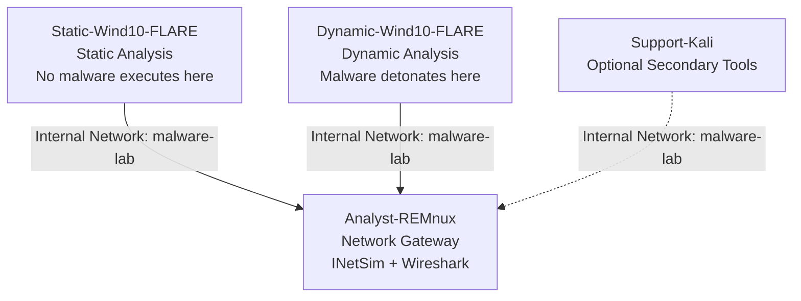
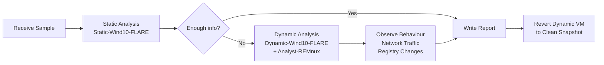

# Lab 01 — Building a Safe Malware Analysis Environment
**Date:** April 2026  
**Author:** Emilio Mardones (Ofendor) - Network Engineer graduate and Cybersecurity enthusiast  
**Status:** 🔄 In Progress  
**References:** Check the last part of this doccument for references.

---

## Overview

This lab documents my personal process of building an isolated malware analysis environment from scratch. 
Before analysing any malware sample, having a safe, isolated and repeatable lab environment is non-negotiable. 
Also, running malware on a regular machine (even with antivirus enabled) is not a controlled environment to deploy such workloads. 
The goal here is to create a space where malware can execute freely, be observed completely, and be contained absolutely for educational purposes.
The deployment of this research is purely subject to New Zealand compliance frameworks together with prestigious regulation institutions like NIST and ISO, from which myself as a student have revised very deeply along the years.

The environment is built on VirtualBox during the first stage, running on a Windows laptop host. The decision to use VirtualBox is based on its free, cross-platform, which supports all the features needed at this stage including snapshots and internal network isolation. 

---

## Lab Architecture

The lab is split across four virtual machines, each with a distinct role. The separation between static and dynamic analysis environments is deliberate because it prevents cross-contamination between clean analysis work and live malware execution. For more information, I suggest every student follow guidance from the following books. You can't start this endeavour without knowing the basic theory:

- [Practical Malware Analysis by Michael Sikorski](https://github.com/adwait1-g/Practical-Malware-Analysis)
- [Evasive Malware: A Field Guide to Detecting, Analyzing, and Defeating Advanced Threats by Kyle Cucci](https://www.amazon.com/gp/product/1718503261?tag=randohouseinc7986-20)
- [Mastering Malware Analysis by Alexey Kleymenov and Amr Thabet](https://github.com/PacktPublishing/Mastering-Malware-Analysis-Second-edition)



The Windows VMs communicate with REMnux through an Internal Network named `malware-lab` from Adapter 1. Internal Network was chosen over Host-Only because it provides complete isolation from the host machine. VMs can reach each other but nothing else. REMnux acts as the network gateway, running INetSim to simulate internet services so malware believes it is online without actually having any external connectivity. 

---

## Virtual Machine Specifications

| VM | OS | RAM | CPUs | Disk | Role |
|---|---|---|---|---|---|
| Static-Wind10-FLARE | Windows 10 Enterprise LTSC 2021 | 3072 MB | 2 | 90 GB | Static analysis workstation |
| Dynamic-Wind10-FLARE | Windows 10 Enterprise LTSC 2021 | 3072 MB | 2 | 90 GB | Malware detonation target |
| Analyst-REMnux | REMnux Linux | 2048 MB | 2 | existing | Network gateway + Linux tools |
| Support-Kali | Kali Linux | 1024 MB | 1 | existing | Optional supplementary tools |

Windows 10 Enterprise LTSC 2021 was chosen specifically for this lab over the standard consumer editions. The LTSC (Long Term Servicing Channel) build is stripped of unnecessary components like the Microsoft Store and Cortana, which reduces background noise during analysis. More importantly, Enterprise LTSC includes Group Policy Editor which is a critical tool for permanently disabling Windows Defender and automatic updates. Home and Pro editions make this significantly harder to achieve reliably. If you want to work withing a smooth environment, take this descision as primordial before executing anything. Avoid breaking your lab before even starting.

---

## Why Two Windows VMs?

Static analysis involves examining a malware sample without executing it, which involves inspecting its structure, strings, imports, and capabilities using tools like PEStudio, CAPA, and FLOSS. This never requires the malware to run, so the static analysis VM stays clean indefinitely and is never reverted.

Dynamic analysis involves actually executing the malware in a controlled environment and observing what it does like what registry keys it creates, what network connections it attempts, what files it drops. This VM gets dirty after every analysis session and is reverted to a clean snapshot before the next one. Keeping these two roles on separate VMs means the static workstation is always stable and the dynamic VM can be freely detonated without consequences.

---

## Network Design Decision

Three network modes were considered: NAT, Host-Only, and Internal Network.

NAT was ruled out immediately — it gives VMs access to the internet through the host, which means live malware could phone home, download additional payloads, or join a botnet using the host's real IP address.

Host-Only was the second option and is widely recommended for beginner labs including in Sikorski's Practical Malware Analysis. It blocks internet access but still allows VM-to-host communication. For this lab Internal Network was chosen instead because it removes the host from the picture entirely, which is the more rigorous choice when the goal is a fully documented, portfolio-quality lab. The decision behind it is purely by convenience, and I encourage you to do your own research based on host trade-offs and capabilities. 

During the initial setup phase, VMs were temporarily set to NAT to download tools and updates. Once everything was installed the network was permanently switched to Internal Network.

---

## Windows Hardening — Very important Steps

The Windows VM required significant hardening before it could be used for malware analysis. The core challenge is that Windows is designed to protect itself: Defender, automatic updates, and Tamper Protection all exist to prevent exactly the kind of environment we need to create. Disabling these features is not negligent; it is a deliberate and necessary part of building a controlled analysis environment inside an isolated VM that will never touch a real network.

### Pre-Installation Verification

Before installing FLARE-VM, the following checks were run in PowerShell to confirm the environment was ready:

```powershell
Write-Host "Username: $env:USERNAME"
Write-Host "Disk Free (GB): $([math]::Round((Get-PSDrive C).Free / 1GB, 2))"
Write-Host "PowerShell Version: $($PSVersionTable.PSVersion.Major)"
Write-Host "Windows Version: $((Get-WmiObject Win32_OperatingSystem).Caption)"
```


**Results:**

| Check | Result | Status |
|---|---|---|
| Username | Ofendor | ✅ No spaces — FLARE-VM requirement |
| Disk Free | 73.76 GB | ✅ Above 60 GB minimum |
| PowerShell Version | 5 | ✅ Meets requirement |
| Windows Version | Microsoft Windows 10 Enterprise LTSC | ✅ Correct edition |
| Defender Status | DISABLED — HRESULT 0x800106ba | ✅ Confirmed |

The username check matters because FLARE-VM's installation script fails if the Windows username contains spaces. This is a known and documented requirement from Mandiant's official repository.

The Defender error code `0x800106ba` means the Defender service is not running — which is exactly the desired state. When Defender is this thoroughly disabled its own management interface loses functionality, which confirms the Group Policy configuration worked correctly.

### Hardening Steps Applied
Before installing any tool, please do these obligatory steps on your Windows 10 Enterprise VM.

| # | Step | Method | Status |
|---|---|---|---|
| 1 | Disable Tamper Protection | Windows Security → Manage Settings → all toggles OFF | ✅ |
| 2 | Disable Real-time Protection | Windows Security → Virus & threat protection → OFF | ✅ |
| 3 | Disable Firewall | Windows Security → Firewall → OFF for Domain, Private, Public | ✅ |
| 4 | Disable Defender permanently | gpedit.msc → Computer Config → Admin Templates → Windows Components → Microsoft Defender Antivirus → Turn off → Enabled | ✅ |
| 5 | Disable Windows Updates | gpedit.msc → Computer Config → Admin Templates → Windows Components → Windows Update → Configure Automatic Updates → Disabled | ✅ |
| 6 | Disable Update services | services.msc → Windows Update + Update Orchestrator → Disabled | ✅ |
| 7 | Disable WaaSMedicSvc | regedit → HKLM\SYSTEM\CurrentControlSet\Services\WaaSMedicSvc → Start = 4 | ✅ |
| 8 | Show file extensions | File Explorer → View → File name extensions + Hidden items | ✅ |
| 9 | Disable UAC | UserAccountControlSettings → slider to Never notify | ✅ |
| 10 | Enable metered connection | Settings → Network → Change connection properties → Metered ON | ✅ |
| 11 | Performance optimisation | System → Advanced → Performance → Adjust for best performance | ✅ |
| 12 | Disable SysMain | services.msc → SysMain → Disabled + Stopped | ✅ |
| 13 | Disable Windows Search | services.msc → Windows Search → Disabled + Stopped | ✅ |
| 14 | Disable Print Spooler | services.msc → Print Spooler → Disabled + Stopped | ✅ |
| 15 | RAM set to 3072 MB | VirtualBox → Settings → System → Motherboard | ✅ |
| 16 | CPU set to 2 cores | VirtualBox → Settings → System → Processor | ✅ |
| 17 | SSD optimisation | VirtualBox → Settings → Storage → VDI → Solid-State Drive ticked | ✅ |
| 18 | Audio disabled | VirtualBox → Settings → Audio → Enable Audio unticked | ✅ |
| 19 | USB disabled | VirtualBox → Settings → USB → Enable USB Controller unticked | ✅ |
| 20 | Host I/O Cache enabled | VirtualBox → Settings → Storage → SATA → Use Host I/O Cache ticked | ✅ |

A few of these steps need brief explanation. Disabling WaaSMedicSvc via registry (Step 7) is necessary because Windows actively protects this service from being disabled through the normal Services interface — it is specifically designed to re-enable Windows Update even if you disable it elsewhere. Setting its Start value to 4 in the registry bypasses this protection.

Disabling UAC (Step 9) prevents Windows from displaying permission prompts when malware attempts to perform privileged operations. During dynamic analysis, UAC prompts would interrupt the malware's execution flow and produce misleading behavioural results.

Showing file extensions (Step 8) is a basic but critical setting. Without it, a file named `invoice.pdf.exe` appears as `invoice.pdf` — which is exactly how many phishing payloads disguise themselves. An analyst cannot work without seeing true file extensions.

---

## VirtualBox Optimisation

Beyond the VM resource allocation, several VirtualBox settings were configured to improve stability and performance during analysis sessions.

| Setting | Value | Reason |
|---|---|---|
| Chipset | PIIX3 | Most compatible with Windows guests |
| Enable I/O APIC | ✅ | Required for multi-core stability |
| Enable EFI | ❌ | Causes boot issues with Windows LTSC |
| Paravirtualization Interface | Hyper-V | Improves Windows guest performance in VirtualBox |
| Enable Nested Paging | ✅ | Improves memory performance |
| Video Memory | 128 MB | Maximum available — prevents display issues |
| Graphics Controller | VBoxSVGA | Recommended for Windows 10 guests |
| 3D Acceleration | ❌ | Known to cause crashes during analysis |
| Audio | ❌ | Not needed — removes attack surface |
| USB Controller | ❌ | Prevents malware from accessing host USB devices |
| Use Host I/O Cache | ✅ | Noticeably improves disk performance on NVMe |
| Solid-State Drive | ✅ | Tells VirtualBox to optimise for SSD I/O patterns |

---

## Snapshot Strategy

Snapshots are the single most important feature of VirtualBox for malware analysis. They allow the entire VM state to be saved at a specific point in time and restored instantly after a malware sample has been run. Without snapshots, every analysis session would require reinstalling Windows from scratch.

| Snapshot Name | Taken When | Purpose |
|---|---|---|
| 01-BASE-Clean-Windows | After hardening, before FLARE-VM | Emergency rollback if FLARE-VM fails |
| 02-FLARE-VM-Installed | After FLARE-VM completes | Clean analysis baseline |
| 03-Static-Win10-SEALED | After network sealed to Internal | Starting point for all static analysis labs |
| 01-REMnux-Updated | After REMnux updates complete | Clean REMnux baseline |
| 02-REMnux-SEALED | After network sealed to Internal | Starting point for network capture sessions |
| 01-Kali-Updated | After Kali updates complete | Clean Kali baseline |

---

## Tool Inventory

### Static Analysis — Static-Wind10-FLARE

These tools examine malware without executing it. The goal is to extract as much information as possible from the file itself before it ever runs — its structure, capabilities, encoded strings, and behavioural indicators.

| Tool | Purpose |
|---|---|
| FLARE-VM | Mandiant's auto-installer for the full analysis toolset |
| PEStudio | PE header examination, import analysis, VirusTotal lookup |
| PE-bear | Deep PE structure parsing and visualisation |
| CFF Explorer VIII | PE structure using Microsoft specification naming — useful for precision |
| DIE — Detect It Easy | Packer detection, compiler identification, entropy analysis |
| HxD | Hex editor for raw binary inspection |
| Strings v2.54 | Extract printable ASCII and Unicode strings from binaries |
| FLOSS | Extract obfuscated and encoded strings that Strings misses |
| CAPA + rules | Identify what a binary is capable of without running it |
| YARA + YARA-Forge | Pattern matching against known malware signatures |
| Ghidra | NSA open-source disassembler and decompiler |
| x64dbg | Debugger for controlled code review |
| CyberChef | Encoding, decoding, and data transformation |
| Python 3 | Scripting support for tool automation |
| 7-Zip | Handle password-protected malware archives |
| Notepad++ | Text editing and log review |

### Dynamic Analysis — Dynamic-Wind10-FLARE

These tools observe malware behaviour during execution. Every tool here answers a specific question — what processes did it create, what registry keys did it touch, what network connections did it attempt, and what did it leave behind.

| Tool | Purpose |
|---|---|
| Process Monitor v4.01 | Real-time file, registry, and process activity with filtering |
| System Informer | Process tree, network connections, memory inspection |
| Regshot v1.9.0 x64 | Registry snapshot comparison before and after execution |
| x64dbg | Step-through debugging with breakpoints |
| OllyDumpEx | Dump unpacked processes from memory during debugging |
| ScyllaHide | Hides debugger presence from anti-debug malware |
| xAnalyzer | Adds code analysis annotations inside x64dbg |
| Speakeasy | Emulate malware behaviour without running it in the OS |
| mal_unpack | Automatically unpack packed malware and dump the payload |

### Network Gateway — Analyst-REMnux

REMnux sits between the Windows VMs and the outside world — except the outside world does not exist. INetSim simulates it instead, responding to DNS queries, HTTP requests, and other network calls so malware believes it is connected to the internet while actually talking to a Linux VM on an isolated network.

| Tool | Purpose |
|---|---|
| INetSim | Simulate DNS, HTTP, FTP, SMTP and other internet services |
| Wireshark | Capture and analyse all network traffic from Windows VMs |
| FLOSS | Linux-based string extraction |
| YARA | Pattern matching on Linux |
| CAPA | Capability detection on Linux |

---

## Analysis Workflow



---

## Operational Rules

These rules apply to every analysis session without exception. They exist because a single mistake — running malware on the wrong VM, leaving the network unsealed, or downloading a sample to the host — can compromise the entire lab and potentially the host machine.

1. No malware ever touches the host laptop under any circumstances
2. Static-Wind10-FLARE is for examination only — malware never executes here
3. Dynamic-Wind10-FLARE is reverted to clean snapshot after every analysis session
4. Maximum two VMs running simultaneously given the 8GB RAM constraint
5. All samples sourced exclusively from Sikorski PMA lab files, MalwareBazaar, or VirusShare
6. Samples are only transferred into VMs through controlled, documented means
7. USB controller disabled on all VMs at all times
8. Shared clipboard and drag-and-drop disabled on all VMs

---

## Sample Sources

| Source | Safety Level | Used When |
|---|---|---|
| Sikorski PMA lab files | Safest — purpose built for learning | Phases 2 to 4 |
| MalwareBazaar — abuse.ch | Safe — tagged, documented, widely studied | Phases 3 to 5 |
| VirusShare | Safe — requires registration, curated | Phase 5 onwards |
| Any.Run and Hybrid Analysis | Online sandbox — never touches VMs directly | Triage reference throughout |

---

## Lab Phases Roadmap

| Phase | Topic | Primary Reference | Status |
|---|---|---|---|
| 1 | Lab Setup | Cucci Appendix A, Module 101 | 🔄 |
| 2 | Basic Static Analysis | Sikorski Ch.1, Module 102 | ⬜ |
| 3 | Basic Dynamic Analysis | Sikorski Ch.3, Module 104 | ⬜ |
| 4 | Debugging and Disassembly | Cucci Ch.3, Module 105 | ⬜ |
| 5 | Assembly Fundamentals | Module 103 | ⬜ |
| 6 | Obfuscation and Evasion | Cucci Ch.4-6, Module 106 | ⬜ |
| 7 | Reporting and Portfolio | All modules | ⬜ |

---

## References

- Sikorski, M. and Honig, A. — Practical Malware Analysis, No Starch Press
- Cucci, K. — Evasive Malware, 2024
- Kleymenov, A. and Thabet, A. — Mastering Malware Analysis, Packt Publishing
- Caendra Inc. — Malware Analysis Professional MAP Course Modules 101-106, 2020
- Zeltser, L. — Reverse Engineering Malware — https://zeltser.com
- Mandiant FLARE-VM — https://github.com/mandiant/flare-vm
- REMnux — https://docs.remnux.org
- TCM Security PMAT Course — https://academy.tcm-sec.com
- Oracle VirtualBox Documentation — https://www.virtualbox.org/manual
- abuse.ch MalwareBazaar — https://bazaar.abuse.ch
- Mandiant CAPA — https://github.com/mandiant/capa
- Mandiant FLOSS — https://github.com/mandiant/flare-floss
- YARA-Forge ruleset — https://github.com/YARAHQ/yara-forge
- Hybrid Analysis — https://www.hybrid-analysis.com
- Any.Run Interactive Sandbox — https://any.run
- VirusTotal — https://www.virustotal.com

---

## Progress Log

| Date | Activity | Status |
|---|---|---|
| April 2026 | Lab architecture designed and documented | ✅ |
| April 2026 | Windows 10 Enterprise LTSC 2021 installed | ✅ |
| April 2026 | VM hardening completed — 20 steps verified | ✅ |
| April 2026 | VirtualBox performance optimisation applied | ✅ |
| April 2026 | VirtualBox Guest Additions installation | 🔄 |
| — | Snapshot 01-BASE-Clean-Windows | ⬜ |
| — | FLARE-VM installation | ⬜ |
| — | Clone Static VM to Dynamic-Wind10-FLARE | ⬜ |
| — | REMnux configuration and updates | ⬜ |
| — | Kali update | ⬜ |
| — | Network sealed to Internal Network on all VMs | ⬜ |
| — | Final SEALED snapshots all VMs | ⬜ |
