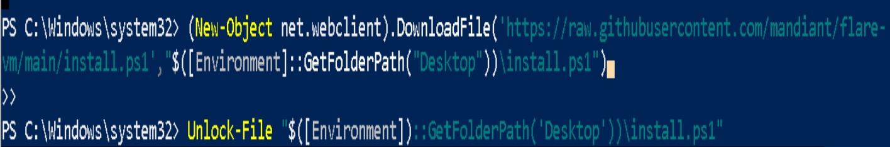
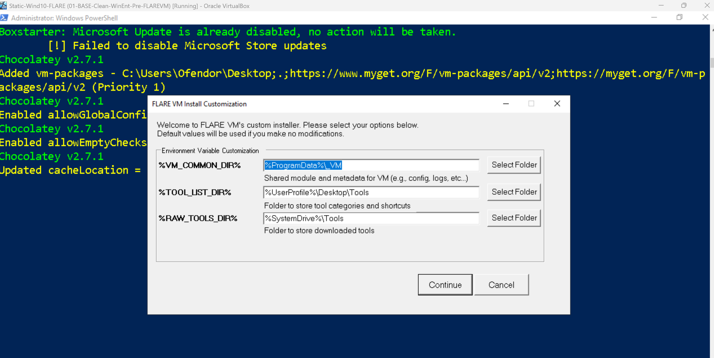
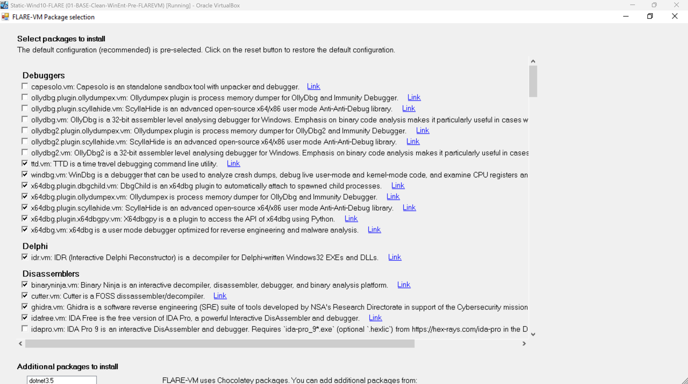

# Lab 01 — FLARE-VM Installation Troubleshooting Log
**Date:** 24 April 2026  
**Author:** Emilio Mardones (Ofendor)  
**Status:** ✅ Resolved  
**Related:** [Lab 01 Setup Notes](lab-01-setup-notes.md)

## Pre-Install Setup and Invocation

This section documents everything that happened before and during the FLARE-VM installation launch. This is important context because several decisions I made at this stage directly caused the failures documented below. I included everything that happened and how I troubleshoot the issues then fixed. Have in mind that issues listed here might differ from the ones you would encounter.
### 1. Download FLARE-VM

FLARE-VM is not a traditional installer. It is a PowerShell-based package manager configuration that uses Chocolatey to install and configure all tools automatically. The repository is cloned directly from Mandiant's GitHub.

```powershell
# Set execution policy to allow PowerShell scripts to run
Set-ExecutionPolicy Unrestricted -Force

# Move to the Desktop where the install will run from
cd $env:USERPROFILE\Desktop

# Download the installer into your VM Desktop
(New-Object net.webclient).DownloadFile('https://raw.githubusercontent.com/mandiant/flare-vm/main/install.ps1',"$([Environment]::GetFolderPath("Desktop"))\install.ps1")
# Note: downloading process starts. A file 'install.ps1' has been downloaded into your desktop. Confirm, move to the next step

# This command should retunr True, meaning the file was downloaded
Test-Path "$env:USERPROFILE\Desktop\install.ps1"
```


**Reason:** PowerShell blocks unsigned scripts by default. The `Unrestricted` is necessary specifically for this install because it will allow the FLARE-VM script to run without a digital signature. This should only be done inside the VM, never on a host machine. 


---
### 2. Disable Windows Defender and Snapshot

Windows Defender must be completely disabled before running FLARE-VM. If Defender is active during installation it will quarantine several tools that are legitimate malware analysis utilities (i.e., FLOSS, CAPA), and trigger Defender signatures because they analyse malicious code patterns. If Defender quarantines these files the entire package chain fails.

```powershell
# Disable Windows Defender real-time protection
Set-MpPreference -DisableRealtimeMonitoring $true

# Disable Defender completely via registry. When asking for a name just type 1
New-ItemProperty -Path "HKLM:\SOFTWARE\Policies\Microsoft\Windows Defender" `
  -Name "DisableAntiSpyware" -Value 1 -PropertyType DWORD -Force

# Verify Defender is disabled
Get-MpPreference | Select-Object DisableRealtimeMonitoring
```

<div align="center">
  
  <p><em>PowerShell verification output confirming monitoring features disabled</em></p>
</div>

⚠️ Now make a base snapshot in case the install fails so you can rollback to this point.

---
### 3. Invoking the FLARE-VM Installer

```powershell
# Download the installer into your VM
Invoke-WebRequest -Uri "https://raw.githubusercontent.com/mandiant/flare-vm/main/install.ps1" -OutFile "$env:USERPROFILE\Desktop\install.ps1"

# Unblock the install script
Unblock-File -Path "$env:USERPROFILE\Desktop\install.ps1"

# Launches the FLARE-VM installer. This script should be use cautiosly because allows unsigned things to run or download
Set-ExecutionPolicy Unrestricted -Scope CurrentUser -Force
```

**Reason: `Unblock-File` first:** Windows marks files downloaded from the internet with an NTFS Zone Identifier flag. PowerShell refuses to run flagged scripts even with `Unrestricted` execution policy. `Unblock-File` removes this flag so the script can execute.

<div align="center">
  
  </div>

```powershell
# Move back to the Desktop directory
cd "$env:USERPROFILE\Desktop"

# Start the installation. It will prompt you for username and password of your current VM, after this it starts installing
.\install.ps1
```
  
---
### 4. FLARE-VM Pre-Installer GUI Checks

After invoking `.\install.ps1` FLARE-VM runs an automated some checks before presenting the tool selection GUI. To satisfy the required set up, the checks are confirmed either True or False:

<div align="center">
  
  </div>

If any check fails FLARE-VM will warn you but still proceed because it does not abort on warnings. Tick the two boxes below and continue.

**Note:** *Tested Windows Version* shows FALSE. Do not worry if you see this. I've installed Windows 10 Enterprise build 19044 LTSC 2021. FLARE-VM's versions are one number above, but this overall satisfies 22H2 window's standard.

<div align="center">
  
  </div>

Second prompt will ask you to specify where to install everything. My suggestion is to leave it as default and continue. 

---

### 5. Tool Selection GUI

<div align="center">
  
  </div>

After the pre-install checks pass FLARE-VM presents a GUI where you select which tool categories and individual tools to install. The selection made during this install included a set of tools that skipped legacy or outdated ones. As per 2026 this is the selection I suggest. Feel free to do your own choice based on your needs:

#### *Debuggers*
Used to run malware step-by-step and inspect behaviour in real time.

| Tool                          | Action   |
| ----------------------------- | -------- |
| capesolo.vm                   | ❌ untick |
| ollydbg.plugin.ollydumpex.vm  | ❌ untick |
| ollydbg.plugin.scyllahide.vm  | ❌ untick |
| ollydbg.vm                    | ❌ untick |
| ollydbg2.plugin.ollydumpex.vm | ❌ untick |
| ollydbg2.plugin.scyllahide.vm | ❌ untick |
| ollydbg2.vm                   | ❌ untick |
| ttd.vm                        | ✅ ticked |
| windbg.vm                     | ✅ ticked |
| x64dbg.plugin.dbgchild.vm     | ✅ ticked |
| x64dbg.plugin.scyllahide.vm   | ✅ ticked |
| x64dbg.plugin.x64dbgpy.vm     | ✅ ticked |
| x64dbg.vm                     | ✅ ticked |
#### *Delphi*
idr.vm keep it ticked
#### *Disassemblers*
Used to convert compiled binaries into readable assembly or pseudo-code.

| Tool           | Action   |
| -------------- | -------- |
| binaryninja.vm | ✅ ticked |
| cutter.vm      | ✅ ticked |
| ghidra.vm      | ✅ ticked |
| idapro.vm      | ✅ ticked |
#### *Documents*
Used to inspect malicious document-based payloads like PDFs, Office, etc.

| Tool                    | Action   |
| ----------------------- | -------- |
| didier-stevens-beta.vm  | ✅ ticked |
| didier-stevens-suite.vm | ✅ ticked |
| ezviewer.vm             | ✅ ticked |
| microsoft-office.vm     | ❌ untick |
| offvis.vm               | ✅ ticked |
| onenoteanalyzer.vm      | ✅ ticked |
| pdfstreamdumper.vm      | ✅ ticked |
#### *.NET*
Used to analyse, decompile, and unpack .NET malware.

| Tool                  | Action   |
| --------------------- | -------- |
| codetrack.vm          | ✅ ticked |
| de4dot-cex.vm         | ✅ ticked |
| dnlib.vm              | ✅ ticked |
| dnspyex.vm            | ✅ ticked |
| dotdumper.vm          | ✅ ticked |
| dotnet-6.vm           | ❌ untick |
| dotnet-8.vm           | ❌ untick |
| dotnet-9.vm           | ❌ untick |
| extreme_dumper.vm     | ✅ ticked |
| garbageman.vm         | ✅ ticked |
| ilspy.vm              | ✅ ticked |
| net-reactor-slayer.vm | ✅ ticked |
| psnotify.vm           | ✅ ticked |
| rundotnetdll.vm       | ✅ ticked |
| sfextract.vm          | ✅ ticked |

#### *File Information*
Used to identify file types, hashes, metadata, and embedded strings.


#### *Hex Editors*
Used to inspect and modify raw binary or hexadecimal data. 
#### *Networking*
Used to monitor, intercept, and simulate network traffic.

#### *Packers*
Used to unpack installers, archives, and packed malware samples.

#### *PE Analysis*
Used to inspect Port Executables (PE) structure and headers

#### *Productivity*
Editing, scripting, compiling, and workflow efficiency tools.

#### *Python*
Decompile and analyse Python-based malware.

#### *Memory*
Used to detect injected code and extract malware from memory.

#### *Utilities*
General use for malware analysis, automation, and detection.


---

### Step 6 — Installation Runs


---
## Overview

This document records every failure, diagnosis, and resolution encountered during the FLARE-VM installation on `Static-Wind10-FLARE`. The install ran for 4 hours 46 minutes and completed successfully at a high level, but 37 out of the selected packages failed due to three distinct root causes. All 37 were eventually recovered manually.

This log exists because documenting what went wrong is as important as documenting what worked. A clean install teaches you nothing. Troubleshooting a broken one teaches you how Windows package management, Python environments, and dependency chains actually behave — which is exactly the kind of knowledge that matters in a SOC or malware analysis role.

---

## Pre-Installation State

Before running FLARE-VM, several tools had been manually pre-installed on the VM including Python 3.13.13, Wireshark, Nmap, and 7-Zip. This was done before understanding that FLARE-VM manages its own tool installation through Chocolatey. These pre-installed tools became the primary source of conflict during the FLARE-VM install.

**Lesson learned:** Never manually install tools on a VM before running FLARE-VM. FLARE-VM expects a clean Windows environment and manages all dependencies itself through Chocolatey. Manual pre-installs create version conflicts that are difficult and time-consuming to resolve.

---

## Root Cause 1 — Python 3.13 MSI Conflict (Exit Code 1603)

### What failed
37 packages failed in a cascade originating from `python313`. The error was:

Packages that failed as a result:
- `ghidra.vm`
- `yara.vm`
- `cyberchef.vm`
- `ipython.vm`
- `magika.vm`
- `rat-king-parser.vm`
- `autoit-ripper.vm`
- `gostringungarbler.vm`
- `unpyc3.vm`
- `uncompyle6.vm`
- `pylingual.vm`
- `libraries.python3.vm`

### Root cause diagnosis
The manually pre-installed Python 3.13 was incomplete. It contained only the runtime DLLs and executable — the `Lib` folder, `Scripts` folder, `tcl` folder, and `pip` were all missing. When FLARE-VM attempted to install Python 3.13 via Chocolatey, Windows MSI detected a conflicting existing installation and blocked the install with code 1603.

This was confirmed by running:

```powershell
dir C:\Python313
```

Which showed only:

No `Lib`, `Scripts`, or `tcl` — a completely broken installation.

Further confirmed by:

```powershell
py -3.13 -c "import sys; print(sys.executable)"
```

Which returned `C:\Python313\python.exe` but then:

```powershell
py -3.13 -m pip --version
```

Returned `No module named pip` — pip was never installed.

### Resolution steps

**Step 1 — Uninstall broken Python 3.13 components via registry**

The standard uninstaller kept prompting Modify/Repair/Uninstall because multiple MSI components were partially registered. Used registry to find exact component GUIDs:

```powershell
Get-ChildItem "HKCU:\SOFTWARE\Python\PythonCore\3.13\InstallPath"
```

Then uninstalled each component by GUID:

```powershell
Start-Process "msiexec.exe" -ArgumentList "/x {3839DEA8-715C-4E8A-A6EE-321BFDC80D97} /quiet" -Wait
Start-Process "msiexec.exe" -ArgumentList "/x {981A986F-505C-426F-8FEB-130AF3FD45BB} /quiet" -Wait
Start-Process "msiexec.exe" -ArgumentList "/x {AC2F2A3B-F563-4C09-8DC5-D403F520E941} /quiet" -Wait
```

**Why this way:** The standard Add/Remove Programs uninstaller was looping because multiple MSI sub-components were registered independently. The GUID-based uninstall bypasses the parent installer and removes each component directly.

**Step 2 — Fresh install using the correct interactive method**

```powershell
Start-Process -FilePath "C:\Users\Ofendor\Downloads\python-3.13.13-amd64.exe" -Wait
```

When the installer opened it showed Modify/Repair/Uninstall again because residual registry entries still existed. Selected **Repair** which correctly reinstalled all components to `C:\Program Files\Python313`.

**Step 3 — Verify clean installation**

```powershell
& "C:\Program Files\Python313\python.exe" --version
& "C:\Program Files\Python313\python.exe" -m pip --version
& "C:\Program Files\Python313\python.exe" -c "import sys; print(sys.prefix)"
```

Expected output:

*In process....*
